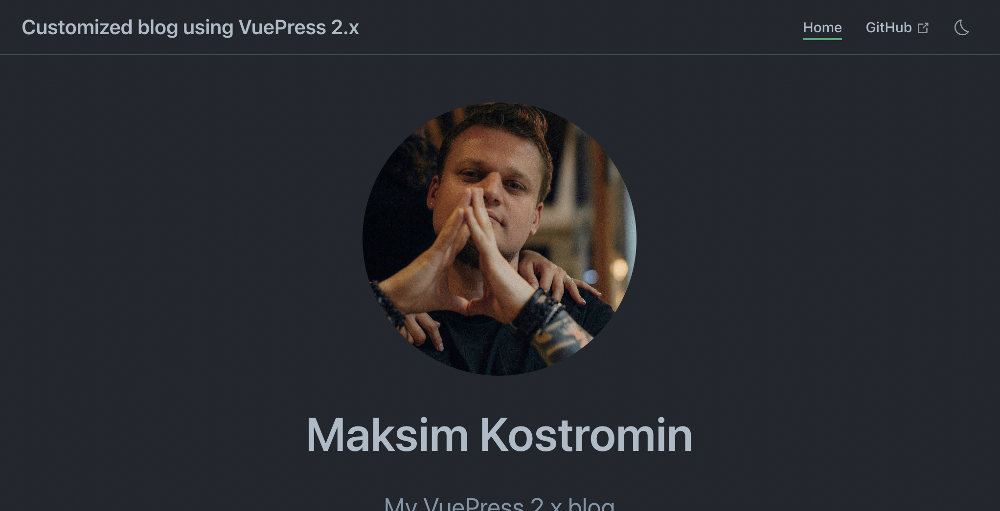

# VuePress 2.x Getting Started

In this guide we will be looking into VuePress 2.x which currently is in beta but very promising.
We will build simple customized blog with home page only. Using this skeleton can be just enough for many people who would like to quickly
get something easy to use, working, fast and very nice looking...

[[toc]]

## Install NodeJS

VuePress required NodeJS to be installed. Please check [download page](https://nodejs.org/uk/download/) to see how to install it on your
operating system.

I personally always prefer use command line:

<CodeGroup>
  <CodeGroupItem title="macOS Homebrew" active>

```bash:no-line-numbers
brew reinstall node
```

  </CodeGroupItem>

  <CodeGroupItem title="Windows scoop">

```batch:no-line-numbers
scoop install nodejs
```

  </CodeGroupItem>
</CodeGroup>

<!-- See: https://v2.vuepress.vuejs.org/reference/default-theme/components.html#codegroupitem -->

::: tip
See more options [here](https://nodejs.org/uk/download/package-manager/)
:::

## Initialize project

Create (for example: `customized-vuepress-2-blog`) project folder and initialize NodeJS project in it:

<CodeGroup>
  <CodeGroupItem title="Unix bash" active>

```bash:no-line-numbers
mkdir ~/customized-vuepress-2-blog && cd $_
npm init -y
```

  </CodeGroupItem>

  <CodeGroupItem title="Windows batch">

```batch:no-line-numbers
mkdir %USERPROFILE%\customized-vuepress-2-blog
cd %USERPROFILE%\customized-vuepress-2-blog
npm init -y
```

  </CodeGroupItem>
</CodeGroup>

## Install minimal require software

Let's install vuepress 2.x as our main blog engine, rimraf to clean files and folders, cross-env and NodeJS types (see `package.json` file):

```bash:no-line-numbers
npm i -ED vuepress@next
npm i -ED cross-env rimraf @types/npm
```

<!--

```bash
npm i -ED vuepress@next vuepress-plugin-use-pages @vuepress/plugin-register-components @vuepress/plugin-search @vuepress/theme-default
npm i -ED cross-env glob @types/npm rimraf
```

-->

## Git ignore configuration

Let's ignore IntelliJ IDEA NodeJS modules and VuePress temporal, cache and output folders and files in `.gitginore` file:

```bash:no-line-numbers
echo "/.idea/"            >> .gitignore
echo "/.vuepress/.cache/" >> .gitignore
echo "/.vuepress/.temp/"  >> .gitignore
echo "/.vuepress/dist/"   >> .gitignore
echo "/node_modules/"     >> .gitignore
```

## Add NPM scripts

Update `package.json` file with next npm-scripts: 

```json:no-line-numbers
{
  "scripts": {
    "dev": "vuepress dev .",
    "build": "vuepress build ."
  }
}
```

## Static resources

Our site should looks unique, so we will require to add our photos, pictures or favicon logos...
If you want to refer on some picture or any other resource by static path you should place that resource in `.vuepress/public` folder.
For example I have 2 files I'm referring on: `favicon.ico` and `me-2020-11.jpeg` in that folder:

```:no-line-numbers
.vuepress/public
├── favicon.ico
└── me-2020-11.jpeg
```

## Site content

Last missing peace we left to do is write our blog home page in user friendly [markdown](https://www.markdownguide.org/basic-syntax/)
format (file with `.md` extensions). This will help us focus on a writing only and VuePress will take care of everything else: styles,
positioning, fonts, highlighting, etc...

```markdown
---
home: true
heroImage: me-2020-11.jpeg
heroText: Maksim Kostromin
tagline: My VuePress 2.x blog
features:
- title: easy to start
  details: Minimal setup with markdown-centered project structure helps you focus on writing.
- title: extensible and flexible
  details: Use Vue components in markdown, and develop custom themes with well known Vue. Enjoy the developer experience of Vue + webpack
           or vite builders capabilities.
- title: extremely fast!
  details: VuePress generates pre-rendered static HTML for each page, and runs as an SPA once a page is loaded.
---

# Hello, World! [](https://github.com/daggerok/customized-vuepress-2-blog/actions/workflows/ci.yaml)

I'm Maksim! I do software engineering, music, love and peace...

[This](https://github.com/daggerok) is my GitHub

To be continue...
```

I won't be explaining in details what this configuration is doing, in most cases it should be obvious... But anyway, you can [go and read
official documentation here](https://v2.vuepress.vuejs.org/reference/default-theme/frontmatter.html#home-page) if needed

## Run dev server to test

Start developer server:

```bash:no-line-numbers
npm run dev
```

Open [http://localhost:8080/](http://localhost:8080/) page to see results:

<CodeGroup>
  <CodeGroupItem title="light theme" active>


  </CodeGroupItem>

  <CodeGroupItem title="dark theme">


  </CodeGroupItem>
</CodeGroup>

## Custom styling

Currently, home page picture looking nice, but we would like to style it a bit. Let's change that picture from square to circle.
To do so, we should add `.vuepress/styles/index.scss` with next context:

```scss
main > header > img {
  border-radius: 50%;
}
```

Let's check our browser on [http://localhost:8080/](http://localhost:8080/):

<CodeGroup>
  <CodeGroupItem title="light theme" active>


  </CodeGroupItem>

  <CodeGroupItem title="dark theme">


  </CodeGroupItem>
</CodeGroup>

Now it looks better 😎

## Customize navbar

One more think I wanted to mention is navbar configuration in VuePress. At the moment we don't have anything in our navbar except
light / dark theme toggle, so let's configure it according to our needs...

### Navbar title

Let's start from title... In my `package.json` file I have description:

```json:no-line-numbers
{
  "description": "Customized blog using VuePress 2.x"
}
```

So I would like to use it as my blog title. To implement this I should create `.vuepress/config.ts` file and add necessary configuration:

```typescript
import { defineUserConfig } from 'vuepress';

// @ts-ignore // const { name, description } = require(`${process.cwd()}/package.json`)
const getPackageJsonFile = await import('../package.json', { assert: { type: 'json' } });
const { description } = getPackageJsonFile.default;

export default defineUserConfig({
    title: description,
});
```

Let's back to browser:

<CodeGroup>
  <CodeGroupItem title="light theme" active>


  </CodeGroupItem>

  <CodeGroupItem title="dark theme">


  </CodeGroupItem>
</CodeGroup>

### Navbar links

With time, we will have many other pages, maybe we will add _About_ page together with _Contacts_ and so on...

#### Home page link

At this point of time I think it would be nice to start from link to main _Home_ page, so any other links could be added latest similarly.
Navbar bar links configuration also should be done in `.vuepress/config.ts` file:

```typescript{1,8-11}
import { defaultTheme, defineUserConfig } from 'vuepress';

const getPackageJsonFile = await import('../package.json', { assert: { type: 'json' } });
const { description: title } = getPackageJsonFile.default;

export default defineUserConfig({
    title,
    theme: defaultTheme({
        navbar: [
            { text: 'Home', link: '/' },
        ],
    }),
});
```

Now let's check our browser:

<CodeGroup>
  <CodeGroupItem title="light theme" active>


  </CodeGroupItem>

  <CodeGroupItem title="dark theme">


  </CodeGroupItem>
</CodeGroup>

#### GitHub repository link

Additionally, we may want to share GitHub or GitLab repository where our blog source codes live. Even for ourselves it would be easier
simply just click to GitHub link and quickly edit post if we would like to change something or fix some misspell... In  `config.ts` file
we should tell VuePress our GitHub username and repository name. My repository FQDN URL in this case is
[https://github.com/daggerok/customized-vuepress-2-blog](https://github.com/daggerok/customized-vuepress-2-blog), so I should use
`daggerok/customized-vuepress-2-blog` part of it as `repo` value. It is enough to have GitHub navbar link, but I would like also specify
`docsBranch` and `docsDir` values:

```typescript{12-14}
import { defaultTheme, defineUserConfig } from 'vuepress';

const getPackageJsonFile = await import('../package.json', { assert: { type: 'json' } });
const { description: title } = getPackageJsonFile.default;

export default defineUserConfig({
    title,
    theme: defaultTheme({
        navbar: [
            { text: 'Home', link: '/' },
        ],
        repo: 'daggerok/customized-vuepress-2-blog',
        docsBranch: 'master',
        docsDir: '.',
    }),
});
```

Now let's check our browser:

<CodeGroup>
  <CodeGroupItem title="light theme" active>


  </CodeGroupItem>

  <CodeGroupItem title="dark theme">



  </CodeGroupItem>
</CodeGroup>

### Navbar search

VuePress has awesome plugin: `@vuepress/plugin-search`, with that plugin we can quickly add basic search capabilities to our blog.
Lets install it:

```bash:no-line-numbers
npm i -ED @vuepress/plugin-search@next
```

And configure, as usual in `config.ts` file:

```typescript{1,16-18}
import { searchPlugin } from '@vuepress/plugin-search';

const getPackageJsonFile = await import('../package.json', { assert: { type: 'json' } });
const { name, description: title } = getPackageJsonFile.default;

export default defineUserConfig({
    title,
    theme: defaultTheme({
        navbar: [
            { text: 'Home', link: '/' },
        ],
        repo: 'daggerok/customized-vuepress-2-blog',
        docsBranch: 'master',
        docsDir: '.',
    }),
    plugins: [
        searchPlugin(),
    ],
});
```

Cool! Now we can check our complete navbar with search functionality in action:

<CodeGroup>
  <CodeGroupItem title="light theme" active>


  </CodeGroupItem>

  <CodeGroupItem title="dark theme">


  </CodeGroupItem>
</CodeGroup>

## Deployment

We've done a lot so far 🤪
It's time to let internet know about it 😁

To do so:
1. First of all, let's install required software:
   ```bash:no-line-numbers
   npm i -ED cross-env
   ```
   We will be using it to run our NPM-scripts with specific environment variable in cases when its needed
2. Then let's add two npm-scripts into `pacjage.json` file:
   ```json:no-line-numbers
   {
     "scripts": {
       "build": "vuepress build .",
       "build-github-pages": "cross-env BASE_HREF=/customized-vuepress-2-blog/ npm run build"
     }
   }
   ```
   Script `build` will optimize our build for production,
   script `build-github-pages` will do same, but with `BASE_HREF` environment variable will be used in next point:
3. Update our `.vuepress/config.ts` file like so:
   ```typescript{1,4}
   const { name, description: title } = require(`${process.cwd()}/package.json`);
   
   export default defineUserConfig({
       base: !process.env.BASE_HREF ? '/' : `/${name}/`,
       title,
       // other part is skipped...
   });
   ```
   Here we check if `BASE_HREF` env. variable wasn't passed, then we know that base must be `/`.
   otherwise it should depends on our repository name, for example: `/customized-vuepress-2-blog/`
4. Create GitHub repository if its not yet created, commit what we did so far and push all your blog source codes in here. For example into
   [https://github.com/daggerok/customized-vuepress-2-blog](https://github.com/daggerok/customized-vuepress-2-blog) repository
5. Next go to repository `Setting` tab, then click `Pages` manu on sidebar, then under `Build and deployment` section choose
   `GitHub Actions` option:
   
6. Last, but not least, create `.github/workflows/pages.yml` file with next content:
   ```yaml
   # Sample workflow for building and deploying a VuePress site to GitHub Pages
   name: Deploy custom VuePress blog with GitHub Pages artifacts
   # Runs on pushes targeting the default branch
   on:
     push:
       branches: ["master"]
     # Allows you to run this workflow manually from the Actions tab
     workflow_dispatch:
   # Sets permissions of the GITHUB_TOKEN to allow deployment to GitHub Pages
   permissions:
     contents: read
     pages: write
     id-token: write
   # Allow one concurrent deployment
   concurrency:
     group: "pages"
     cancel-in-progress: true
   # Use concrete NodeJS version:
   env:
     NODE_VERSION: 18.4.0
   jobs:
     # Build job:
     build:
       runs-on: ubuntu-latest
       steps:
         - uses: actions/checkout@v3
         - name: Setup Pages
           uses: actions/configure-pages@v1
         - uses: actions/cache@v3
           id: ci
           with:
             path: |
               ~/.npm
               ~/.node
             key: ${{ runner.os }}-${{ hashFiles('**/package.json', '**/package-lock.json') }}
         - uses: actions/setup-node@v3
           with:
             node-version: ${{ env.NODE_VERSION }}
         - run: npm i -E
         - run: npm run build-github-pages
         - name: Upload artifact
           uses: actions/upload-pages-artifact@v1
           with:
             path: '.vuepress/dist'
     # Deployment job:
     deploy:
       environment:
         name: github-pages
         url: ${{ steps.deployment.outputs.page_url }}
       runs-on: ubuntu-latest
       needs: build
       steps:
         - name: Deploy to GitHub Pages
           id: deployment
           uses: actions/deploy-pages@v1
   ```
   This GitHub action contains two jobs: one for project artifact build + upload and another for its deployment on any master branch push
7. Commit and push changes from previous step and wait for CI completion. Afterall, you should see your awesome customized VuePress blog
   gets published, for example here:
   [https://daggerok.github.io/customized-vuepress-2-blog/](https://daggerok.github.io/customized-vuepress-2-blog/)

## Create custom components

Let's say we wanna custom `Footer` which can be easily used in our pages or components, just like so:

```markdown
# My post

My content....

<Footer />
```

Create component folder: `.vuepress/components/layers`

<CodeGroup>
  <CodeGroupItem title="Unix bash" active>

```bash:no-line-numbers
mkdir .vuepress/components
```
  </CodeGroupItem>

  <CodeGroupItem title="Windows batch">

```batch:no-line-numbers
mkdir .vuepress\components
```
  </CodeGroupItem>
</CodeGroup>

Create `.vuepress/components/Footer.vue` component:

```vue
<template>
  <div class="footer"> Maksim Kostromin © 2022-present 🙃</div>
</template>

<script>
import { defineComponent } from 'vue';
export default defineComponent({
  name: 'Footer',
});
</script>

<style scoped lang="scss">
div.footer {
  display: flex;
  justify-content: center;
  align-items: center;
  width: 100%;
  height: 3rem;
  min-height: 2rem;
  margin-top: -3rem;
  border-top: none !important;
}
</style>
```

Now we should help VuePress to register our components.

Install `@vuepress/plugin-register-components` package:

```bash
npm i -ED @vuepress/plugin-register-components@next
```

And finally update our `.vuepress/index.ts` file:

```typescript{2,8-10}
import { getDirname, path } from '@vuepress/utils';
import { registerComponentsPlugin } from '@vuepress/plugin-register-components';

const __dirname = getDirname(import.meta.url);

export default defineUserConfig({
  plugins: [
    registerComponentsPlugin({
      componentsDir: path.resolve(__dirname, './components'),
    }),
  ],
  
  // ...skipped after...
});
```

Now we can used our `Footer` directly in markdown files or import it in our vue components just like so:

```typescript
import Footer from '@/components/Footer.vue';
```

## Add custom local theme

Let'e imagine we want to have our blog unique, so we've decide to add our custom `Footer` component for every page
in our blog... To do so we must create our own custom local theme.

Let's create folders `.vuepress/theme` and `.vuepress/theme/layers` which will contains custom theme files:

<CodeGroup>
  <CodeGroupItem title="Unix bash" active>

```bash:no-line-numbers
mkdir .vuepress/theme
mkdir .vuepress/theme/layers
```
  </CodeGroupItem>

  <CodeGroupItem title="Windows batch">

```batch:no-line-numbers
mkdir .vuepress\theme
mkdir .vuepress\theme\layers
```
  </CodeGroupItem>
</CodeGroup>

Create `.vuepress/theme/layers/Layout.vue` layout:

```vue
<script setup>
import ParentLayout from '@vuepress/theme-default/lib/client/layouts/Layout.vue';
import Footer from '@/components/Footer.vue';
</script>

<template>
  <div class="wrapper">
    <div class="content-wrapping-section">
      <ParentLayout/>
    </div>
    <div class="footer">
      <Footer/>
    </div>
  </div>
</template>
```

Create `.vuepress/theme/client.ts` file:

```typescript
import { defineClientConfig } from '@vuepress/client';
import Layout from './layouts/Layout.vue';

export default defineClientConfig({
    layouts: {
        Layout,
        NotFound: Layout,
    },
});
```

Create `.vuepress/theme/index.ts` file:

```typescript
import type { Theme } from '@vuepress/core';
import { defaultTheme, type DefaultThemeOptions } from '@vuepress/theme-default';
import { getDirname, path } from '@vuepress/utils';

const __dirname = getDirname(import.meta.url)

export const myBlogLocalTheme = (options: DefaultThemeOptions): Theme => {
   return {
      name: 'vuepress-theme-local',
      extends: defaultTheme(options),

      // override layouts in child theme's client config file:
      clientConfigFile: path.resolve(__dirname, './client.ts'),

      // add component alias. Usage:
      // import { MyComponent } from '@/components/MyComponent';
      // it will import component from .vuepress/components/MyComponent.vue file
      alias: {
         '@': path.resolve(__dirname, '..'),
      },
   };
};
```

Now update `.vuepress/config.ts` file accordingly to use it in your VuePress blog:

```typescript{3,6,13}
// ...skipped before...

import { myBlogLocalTheme } from './theme';

export default defineUserConfig({
  theme: myBlogLocalTheme({
    navbar: [
      { text: 'Home', link: '/' },
    ],
    repo: 'daggerok/customized-vuepress-2-blog',
    docsBranch: 'master',
    docsDir: '.',
  }),

  // ...skipped after...
});
```

See: [Official extending section](https://v2.vuepress.vuejs.org/reference/default-theme/extending.html#layout-slots) for more details

Congrats! 🎉💪👏

<!--

## TODO

* Next post: Add more blog posts, use globs to autoconfigure blog sidebar and page plugin
* Next post: Use page plugin to create custom reusable blog posts component to be used on home and blog pages
* Next post: [Add multi-language support](https://v2.vuepress.vuejs.org/guide/i18n.html)

-->

## Useful links

* [GitHub repository](https://github.com/daggerok/customized-vuepress-2-blog)
* [VuePress 2.x site](https://v2.vuepress.vuejs.org/)

<script>
  export default {
    mounted: async function mounted() {
      const html = await document.querySelector('html');
      const classList = html.classList;
      const isDark = classList.contains('dark');
      console.log('isDark', isDark);
      if (!isDark) {
        document.querySelectorAll('.code-group__nav').forEach(el => {
          el.style.backgroundColor = '#6a8bad';
        });
        return;
      }
      const tabs = await Promise.all(document.querySelectorAll('button.code-group__nav-tab'));
      tabs.filter(el => el.textContent === 'dark theme')
          .filter(el => el.getAttribute('aria-pressed') !== true)
          .filter(el => el.getAttribute('aria-expanded') !== true)
          .forEach(el => el.click());
      console.log('clicked.');
    },
  }
</script>
