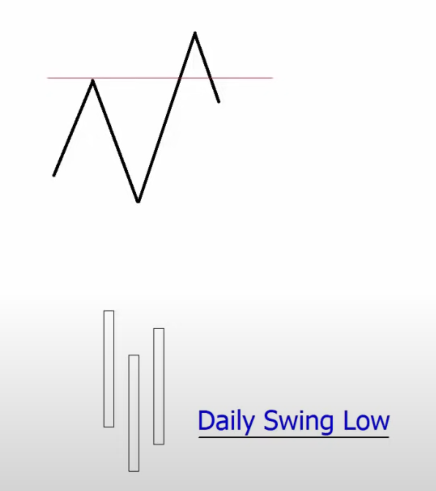

# ICT
This is my ICT notes. I started learn it this (2023) year, but topic is quite big and complex, so I feel
that I should make some notes about it

## Learnng Plan
* ICT 2022 Mentorship
* ICT Silve Bullet
* Sniper Forex Series (to learn OB)

## When professionals trade?
* In bearish market 70% of time high of the week will be formed on Tue or Wed
* In bullish market 70% of time low of the week will be formed on Mon or Tue
* Do not trade on Wensday, Thoursday and Friday leading up to Non-Farm Payroll (NFP) because ther are is going to be a lot of volatility 
* Monday and Tuesday
* Wensday will have big price move if on Tue price was consolidate

## Institutional Price Delivery Algorythm (IPTA)

General order in the daily range:
* Consolidation = Asia
* Expansion/Reversal = London (Normally makes the high or low of day)
* Consolidation = Pre-NY (5:00am → 8:00am EST)
* Retracement = (8:00 → 8.30am EST)
* Expansion = NY
* Reversal = NY
* Consolidation = Near/after market close

General order in the weekly range:
* Sunday Open = Consolidation
* Monday = Expansion/Reversal
* Tuesday = Reversal
* Wednesday = Consolidation
* Friday = Reversal/Retracement/Expansion

## [Seasonality](https://www.youtube.com/watch?v=tmeCWULSTHc&t=26s)
* **SMT Divergence** (Smart Money Technique Divergence) is showing a willingness to correct the correlation.
  Usually it happens
  - At 8:30
  - Around 9:30 when there are already been nice early run before 7:00 or 8:00
  - At news events beign released
  And if we have a bias then it's healpful: For example **we are bulish** and **NASDAQ did a lower low**
  but **E-MINI S&P 500 - a higher low**, then we shouldn't trade **NASDAQ**, but **S&P 500** because its not
  likely to go lower, but higher
* On a **daily timeframe** charts we are looking for **SMT divergence** between all these 3 Indexes:
  - NASDAQ
  - S&P 500
  - DOW
* **In spring in between Apr and May** we are looking for **Bearish SMT divergence** when one of these indexes
  will not be able to form higher high.
  Once that happened we are hunt for **ICT 2022 Mentorship Bearish Model**
* **In autumn (fall) in between 3rd week of Spe and 3rd week of Nov** we are looking for
  **Billush SMT divergence** when one of these indexes will not be able to form lower low.
  Once that happened we are hunt for **ICT 2022 Mentorship Bullish Model**
* Weekly bias. [On a weekly chart (preferably before week start) we should think of where weekly candle should go
  higher or lower](https://youtu.be/tmeCWULSTHc?si=Fs4jFaHgYEBTnhH1&t=983). It depends on FED how ots gonna rase
  interrest rate (Stock markets doesn't like that). If we are in a earching season, then there are a lot of
  valotility because of earnings. All this factors - are drivers to where is market is going to go, up or down to
  drawing a liquidity or deliver price effectively to some previously formed FVG. So the only thing we are looking
  for is a likly movement higher or lower based on a weekly candle
* Daily bias. [On a daily chart we are lookling for swing highs and swing lows to get your liquidity
  ](https://youtu.be/tmeCWULSTHc?si=HZNXc0wvjaIxyMHE&t=995). Major treading time to looking for reasons what makes
  market go higher or lower will be found on that TF (time frame). We wanna see every STL (short teram low) which
  is going to be a sell stops on a bearish bias or buy stops on a bulish bias. Market is always drawing one of
  these things:
  - its drawing to stops, which is liquidity, or
  - its running to [imbalance (FVG)](https://youtu.be/tmeCWULSTHc?si=ObTgBNA4WAAsjBCW&t=1064)

## Killzones
* Asia: 20:00-00:00
* London: 02:00-05:00
* New York AM Session: 8:30-11:00 (FX pairs: 7:00-10:00)
* New York PM Session: 13:30-16:00
* New York Last 1 Hour of PM Session: 15:00-16:00

## Silver bullet
* London SB: 03:00-04:00
* New York AM SB: 10:00-11:00
* New York PM SB: 14:00-15:00

## [Internal range liquidity & Market structure shift](https://www.youtube.com/watch?v=nQfHZ2DEJ8c)
* [Sell Side Liquidity](https://www.youtube.com/watch?v=nQfHZ2DEJ8c&t=114s)
* [What is an Order Block](https://www.youtube.com/watch?v=nQfHZ2DEJ8c&t=1461s)
* [Homework](https://www.youtube.com/watch?v=nQfHZ2DEJ8c&t=2143s)
* [Maximum risk on trade](https://www.youtube.com/watch?v=nQfHZ2DEJ8c&t=2944s)

## Glossary and acronyms
* **Buyside Liquidity** (BL) - its **Buy Stops** (BS) retail traders put above **Old High** (OH) or above
  **Short Tearm High** (STH)
* **Buyside Imbalance Sellside Inefficiency** (BISI)
* **Buy Stops** (BS). Stops below **BL** Retail Trader idea of support level on long positions, lower than old low
* **Sellside Liquidity** (SL) - its **Sell Stops** (SS) retail traders put below **Old Low** (OL) or below
  **Short Tearm Low** (STL)
* **Sellside Imbalance Buyside Inefficiency** (SIBI)
* **Sell Stops** (SS). Stops above **SL** Retail Trader idea of resistance level on short positions, higher than old high
* **Consequent Encuragment** its a middle of the gap
* **Regular Trading Hours** (RTH). Hours when algorithm is delivering price to **SMT**
* **Electronic Trading Hours** (ETH). All available trading hours on a chart
* **Liquidity Viod** (LV). Gap between two candels where no trading at all, for example between **NWOGap High** and
  **NWOG Low**
* **Market Sructure Shift** (MSS). Bullish MSS, Bearish MSS
* [**New Week Opening Gap** (NWOG)](https://www.youtube.com/live/LoXPDfFoLSc?si=Ob_gRATBCm7Fgm2W&t=1251). Gap between
  close price of previous Friday at 4:30pm and open price of previous Sunday at 6pm
* **New Week Opening Gap High** (NWOG High). Example: Sun 01 Oct '23 6pm
* **New Week Opening Gap Consequent Encuragment** (NWOG C.E.). Mid point of the NWOG
* **New Week Opening Gap Low** (NWOG Low). Example: Fri 29 Sep '23 4:30pm
* **New Day Opening Gap** (NDOG). Distance between 5pm and opening 6pm
* [**Opening Range Gap** (ORG)](https://www.youtube.com/live/LoXPDfFoLSc?si=Gp6dGyGANROcwTpQ&t=1327). Where we have
  relation between **RTH**
* **Opening Range Gap Settlement** (ORG Settlement). Previous day close price on **RTH**. Word Settlement is going to
  be changed in a moment where market price is opened at 9:30am... If current price is opened above
  **ORG Settlement**, then we should change **ORG Settlement** to **ORG Low**, otherwise **ORG Settlement** must be
  changed to **ORG High** as far opening price is under the **RTH** previously closed price
* **Optimal Trade Entry** (OTE) [using Breaking Market Structure](https://www.youtube.com/watch?v=aQrd75xwBS4)
* **Old High** or **Old Low** is a first nearest Swing High or Swing Low you can found going back on a chart starting
  from current candle. If there are any other importants like **Fair Value Gap** or **Volume Gap** on a chart exists
  near that Old High / Old Low, then we should watch our trade range in between that and current candles highs and lows
  current candle and candle with
* **Silver Bullet** (SB). 1-hour time interval where a **FVG** can be touched: 10am-11am, 1pm-2pm
* **Smart Money** (SM)
* **Smart Money Concepts** (SMC)
* **Smart Money Traders** (SMT)
* **Stop Raid** (SR)
* **PM Trading Session** - 14:00-16:00 time interval (from 2pm till 4pm)
* **Final Hour Of PM Trading Session** - 15:00-16:00 time interval (from 3pm till 4pm) where is possibility of price action
  move in the end of the day. If you don't have a setup by 10 minutes to 4 then don't do anything. Usually setup should appear
  in between 15:15-15:45 little tiny small sweet spot where I'm looking for liquidity (above the marketplace if I'm bulish or
  below marketplace if I'm bearish) or if there is an imbalance (BISI if I'm bulish, SIBI if I'm bearish)

## Rules
* Before trade always check highs and lows marker could sweep above or below for **Stop Raid**:
  * Asian session in between 7pm-9pm
  * London session in between 2am-5am
  * New York session in between 7am-10am
  * And finally intrady just before 9:30am 
* Trade from Monday till Friday:
  * From 8:30am (or 9:30am depends on year time) till 12pm
  * From 1-1:30pm till 4-4:30pm
* Do not trade on Thursday and Friday in between 8am and 10am
* **FVG** with **OTE** is signifficant only if before it we traded into Sellside Liquidity or Buyside Liquidity meaning
  that is should be traded under Retail Trader idea of support level / double bottom or it should be traded above Retail
  trader idea of resistance level / double top / head and sholders, etc... 
* Every gap or inefficiency should delivered (filled) with both up and down price actions. So if Buyside delivery (when
  marked goes up) occurred it reasonable expect that later Sellside delivery is also going to be done eventually
* In most cases in 8:30am when news are came out the first run whatever that direction is in price that is the fake
  move - that is a first stage delivery. The second stage is the opposite is whatever that is meaning we will see price
  do reversal.
  For example:
  
  
  Here everybody thinking: "okay, it's gonna go lower" and it's crashes everyone that's already in long... And it did so
  in stunning fashion very quickly, which scares everyone in a marketplace, it terrifies them! ...Then the market does
  a second stage: what the 8:30am news sentiment shift caused everyone to think that it would keep going lower and keep
  going lower... They trapped them short and then they run against the move that took place in the morning:
  
  

## NWOG
New Week Opening Gap

## How to define Opening Range Settlement and Opening Range Gap

* Enable RTH
* Mark with horiszontal line prev. Friday close 16:14pm price - **Opening Range Settlement**
* As soon Market open 9:30am price appears then mark ractangle with consequent encouragement line from horizontal price
  to Market open 9:30am price. Consequent encouragement line - **Opening Range Gap**
* If Market open 9:30am price will be higher than Friday close 16:14pm price then **Opening Range Settlement** becomes
  **Opening Range Low**
* If Market open 9:30am price will be lower than Friday close 16:14pm price then **Opening Range Settlement** becomes
  **Opening Range High**

## Mastering High Probability Scalping
ICT Directional Bias For Sculping

See this [ICT - Mastering High Probability Scalping Volumes 1 - 3](https://www.youtube.com/watch?v=uE-aaP16nOw&list=PLVgHx4Z63paYdrA3rupIlFhsYFA07GJGP&index=1&ab_channel=TheInnerCircleTrader)
YouTube playlist

### Implementing Bullish Daily Bias

 

If we are **Bullish**, we are looking for **daily (1D) chart** and when we see **Daily Swing Low (DSL)** formaation - what we are lookibg
for is next:

* **DSL** occur **only after** previous **Swing Daily High (DSH)** was broken (like **Long Tearm High (LTH)** or **Short Tearm High (STH)**)
  when that happened:
* We are on a **Bullish Alert** and our focus is on **Last Candle High (Right Candle High)**, so we wanna see the high be traded
  through on next day or before that we want to see some retraisment
* Once next day does that - we know that next we will anticipate a **run on previous day high liquidity**

### Implementing Bearish Daily Bias

 

If we are **Bearish**, we are looking for **1D chart** and when we see **DSH** formaation - what
we are lookibg for is next:

* **DSH** occur **only after** previous **DSL** was broken, when that happened:
* We are on a **Bearish Alert** and our focus is on **Last Candle Low (Right Candle Low)**, so we wanna see the low be traded
  through on next day or before that we want to see some retraisment
* Once next day does that - we know that next we will anticipate a **run on previous day low liquidity**

### ICT Power Of 3 Concept

#### Bullish Daily Bias

When The Daily Bias Is Bullish:

* Confirm London session was **Bullish**
* Wait for 8am New York time to stalk a **Long Position**
* Between 8am - 9:30am New York time it may form
* After 8am New York time wait for **Retracement Lower**
* New York session will retrace from the SWH
* Ideally select retracements of at least 20 pips lower
* If no retracement of 20 pips forms by 10am - walk
* If it does form - enter on the 62% fib as it drops down
* Expect price to retest High of Day or a Previous Days High then Targets 1 & 2

#### Bearish Daily Bias

When The Daily Bias Is Bearish:

* Confirm London session was **Bearish**
* Wait for 8am New York time to stalk a **Short Position**
* Between 8am - 9:30am New York time it should form
* After 8am New York time wait for **Retracement Higher**
* New York session will retrace from the SWL
* Ideally select retracements of at least 20 pips higher
* If no retracement of 20 pips forms by 10am - walk
* If it does form - enter on the 62% fib as it rallies up
* Expect price to retest Low of Day or a Previous Days Low then Targets 1 & 2

