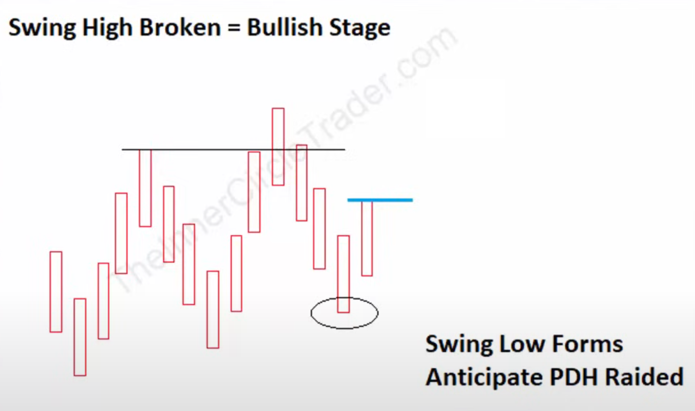
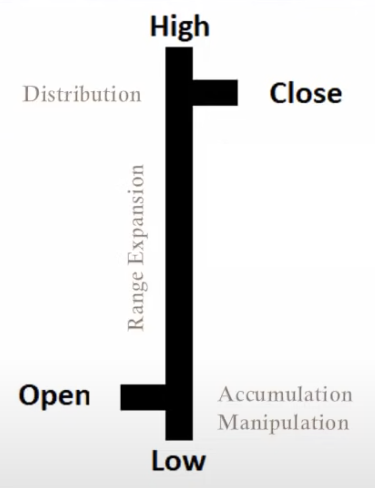
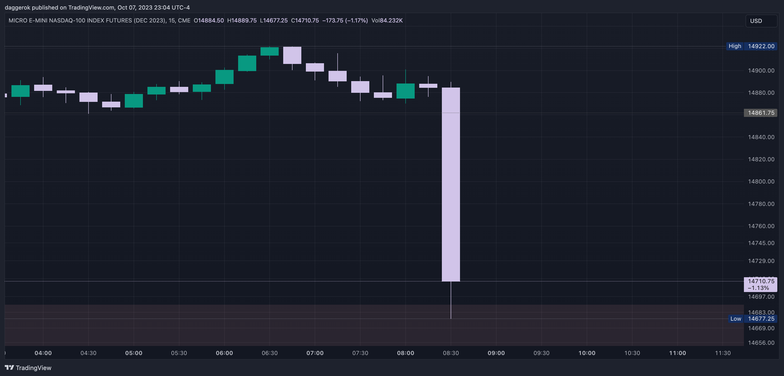
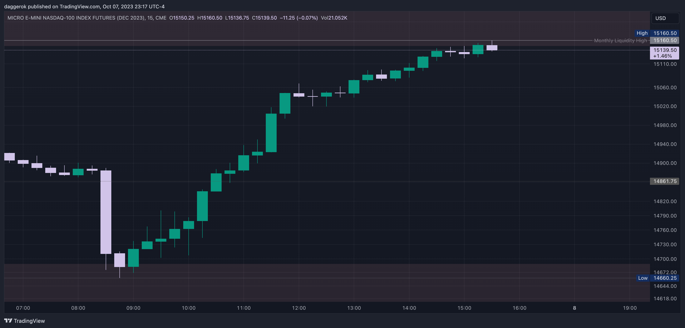

# ICT
This is my ICT notes. I started learn it 2023 year, but topic is quite big and complex.
ICT always saying that hist students should make a notes because its not realistic to
keep memorize everything...

## 2023

### February 15, 2023 ES Live Commentary AM Opening Session
[February 15, 2023 ES Live Commentary AM Opening Session](https://www.youtube.com/watch?v=8YSVu51hUWQ)

We should always look on multiple chArts: ES, NQ, YM, DXY. All markets should agree:
if Dollar is going higher, then we are looking for short setups on indexes (risk-off mode);
if Dollar is moving lower, then we are looking for longs on indexes (risk-on mode)

### February 15, 2023 ES Session Review
[February 15, 2023 ES Session Review](https://www.youtube.com/watch?v=SSWN6YSVyFY)

NDOG (New Day Opening Gap) is price in between 5pm market close and 6pm market open its
a reference point where algorithm will refer and come back later.

The Bodies tell the story, the Wicks do the damage.

If we expect that market is going to be hard to read (for example due to high impact
news), we can trade on 7:00am-8:30am to utilize that interval during pre-market before
news driver (medium to high impact news) and expect that we can reach our target at 8:30am

Symmetrical market is when for example we have lower low in NQ and ES and higher high on DXY.
This is we want to see to trade, if at any time we see non-symmetrical market we want to step
away because of sentiment shift unfolding. Example: if we for example cannot see dollar
index higher high when it was expected - it's a dollar index divergence, and it's a signal
for  smart money, so they probably will seek for liquidity (external - Buyside or internal -
50% of dealer range, bearish gaps or blocks...)

Buy model on last hour macro 15:15-15:45 after stops (liquidity) has been taken is not a
Market Maker Buy Model is when market starts booking higher price until we get a pool of
liquidity (Buyside liquidity) or premium inefficiency (FVG SiBi)

Order Block it's a Change in the State of Delivery.
Order block start on opening price of consecutive sets of down close candles after its validation.
Order Block is valid as soon as upper close candle goes 1 tick above Order Block.
Order Block is fair value, it means that algorithm with offer that fair value to the Smart Money.

### February 16, 2023 ES Opening Session Commentary
[February 16, 2023 ES Opening Session Commentary](https://www.youtube.com/watch?v=KXx07qzW5u0)

New Week Opening gap (NWOG) is gap between 16:00 on Fri and 18:00 on Sun.
New Week/Day Opening gap (NDOG) is gap between 16:00 and 18:00 of current.
Opening Range Gap (OR) is gap between yesterday's 16:00 closing price and today's 9:30 opening price.

If we had news drivers and big run before 9:30 then we can expect price choppiness and/or run agains
profitable traders (who was able to catch this move) stops. For example after bin market drop if we're
not going to go lower ask yourself "where is the money?" right, - higher buyside liquidity on bearish
inefficiencies, order blocks, or previous highs, or relative equals highs...

Breaker Block is: Low, Higher High, Lower Low, retrace to block and go higher.
Mitigation Block its almost opposite to Bullish Breaker Block: Low, Higher High, Higher Low, retrace
to block and go higher.

If we want to confirm that our Bullish Breaker Block invalid - price should at least go lower through
it and then back upper, so Breaker will act as resistance (similar to -iFVG).

### ICT February 24 - Conquering Fear Of Being Wrong Vs. Profitability
[ICT February 24 - Conquering Fear Of Being Wrong Vs. Profitability](https://www.youtube.com/watch?v=qUYWVwyRhZs)

Market Structure Shift (MSS) is short term change in market sentiment and it will deliver on a short
term basis. MSS doesn't require close above a STH, its just need to trade above it.

Market Structure Break (MSB) is where entire trend in marketplace changes, and we're going into
longer higher timeframe delivery of the price (where if its bullish, and we have MSB that is bearish,
then we would say that is change in trend, aka reversal).

Once MSS occur algorithm will start a macro for price delivery.

Macro is a short list of instructions that algorithm will run in a price engine which creates these
fluctuations in price action, and it doesn't matter what buying and selling pressure currently is.

+SMTD is only confirmation tool that showing that Sellside Liquidity was taken, and we're going
higher if we are bullish.

You do not ever want to be trading ahead of CPI numbers, it will rip your face off.

When we're watching +OB, we are looking on its high and Mean Threshold and expecting a reaction higher
from it.

Bullish Propulsion Block its nested OB within another OB.

## 2024

### Lecture On ICT Order Blocks & Tape Reading April 18, 2024
[Lecture On ICT Order Blocks & Tape Reading April 18, 2024](https://www.youtube.com/watch?v=BxR3tVRS_FI)

Bias must be found based on weekly and daily charts.
Don't build bias based on anything what less than 1 hour.

SM doing stop runs only to kick out everyone who can be profitable and
to catch traders who created limit orders for breakouts.

Seasonal tendency take price down into the spring decline.

In days when we have high impacted news we should use 5 minutes
timeframe to reduce choppiness and spottiness of price fluctuation.
In all other "normal" trading days we can use 1 minute and sub-minute
timeframes.
On high impact news drivers we should wait and use 5 minutes charts at
least 15-20-30 minutes and only then we can start dropping down below
5 minutes charts for looking for inefficiencies because we won't
probably pick a right one...

When I'm bullish, my stop loss should have 3 PD arrays above it or 
3 PD arrays below it when I'm bearish.

Dealer range is high that was engaged buyside and low that was engaged sellside.
And it must be on a timeframe we are looking for analysis (5 minutes on high
impact driver news during 15-30 minutes after release). Best moves starts from \
running stops, so if we are bearish - we want to see that market take buy stops
first.

Algorithm is designed to range wide to seek liquidity.

Important to keep in mind quadrants and remember that best entries when we are:
* bullish: in between 50%-100% of +OB or +FVG
* bearish: in between 0%-50% of -OB or -FVG

### How To Read Price With Or Without A Bias - April 29, 2024
[How To Read Price With Or Without A Bias - April 29, 2024](https://www.youtube.com/watch?v=LpdFdIckXqo)

Wicks == Gaps. Our focus on C.E. or upper quadrants if bullish (lower quadrants when bearish).

When we have high impact news, we are wait for damage and manipulation. Only then, after all retail
traders will be stopped out from their seats we are looking for turtle sups or other setups.

If there are no high impact news, then we can relay on macros (every single trading hour 20 minutes
macros): 9:50am-10:10am, 10:50am-11:10am, 1:50pm-2:10pm, 2:50pm-3:10pm and 3:15-3:45 last hour macro

If bullish and want to use +OB, then there should be only few down closed candles that we should use
only as opportunity to buy. If there are a lot of down closed candles, then we either on
consolidation or near to high, but definitely not in up move.

Same thing in relation to FVG, we don't want to see every FVG was fully rebalanced, we do want to
see price left some inefficiency stay opened, not fully closed, otherwise we maybe on end of the run

To capture nice day trades we need to look at 15m charts or 1h charts.
To capture nice swing trades we need to look at 1h charts or 4h charts.
To capture nice position trades we need to look at 1D charts or 1W charts.

Change in a state of delivery it's always opening price of OB. Delivery it's
directional price run, so it's going to be a change in the direction of price.

### Reading Price Without A Bias - April 30, 2024
[Reading Price Without A Bias - April 30, 2024](https://www.youtube.com/watch?v=joqM_Z96vtM)

Do not trade on non-farm payroll week from after lunch Wed till Fri.
If we want we can trade 15-30 minutes after non-farm payroll numbers report.

Reclaimed FVG / Reclaimed OB is when initial expectations is used at later time.
IFGV / Mitigation block is when its reverse the role.

Bounce price range is when you have 2 inefficiencies (BiSi and SiBi) in opposing
directions in a same general area in terms of price. Best is with 1 candle in a
middle because it would be sudden and more impactful. Or it could be pattern called
island reversal. We can trade is as iFVG

### Keynotes & Observations - May 01, 2024
[Keynotes & Observations - May 01, 2024]()

In FOMC day is 2 stage event: 1) Move start on 14:00 and complete at 14:30 2) At 14:35
I can do either reversal or continue

Non-Farm Payroll is also nopt possible for trading - algorithm is turn off and manual
intervention will be turned on

How to detect time when LRL in place? If there are no news drivers.

Session bias can be built for 4h and 1h charts: were we are? where are we going from?
where are we going to (block, inefficiency, C.E, draw on liquidity etc...)?

Why we don't want Opening Range Gap fill completely if we are Bearish? Because if it
cannot fill that Gap it means that it Very Bearish.

We can expect as retail traders want to go short after big down day, so smart money
wants to trap them. Takeaway from this is: when retail public crowd want to sell,
smart money want to move markets higher to get everybody else Byu stops.

<!--

# Old

## Learnng Plan
* ICT 2022 Mentorship
  * FVG
  * Power Of Three
  * Bias
  * Risk Management
  * Money Management
* ICT Silve Bullet
* Optimal Trade Entry (OTE)
* Mastering High Probability Scalping
  * Directional Bias
  * PO3
  * Reversal
  * Money Management
* Market Maker Series
  * Who is MM?
  * Bias
* Sniper Forex Series

## Market Maker Series (2021)

* Central Banks - **are Maket Makers**
* Dealers like Chase, BofA, Citi or Goldman Suchs, etc - **are not Market Makers**
* Brokers like TD Ameritrade, Charles Schwab, etc - **are not Market Makers**

### Bias
To have an idea where is market is goling to go we need a Bias.
So how to get that Bias?

#### Quantitative Analysis (objective)
First of all we can make a Quantitative Analysis:
* Global Interest Rates on [global-rates.com](https://www.global-rates.com/en/interest-rates/central-banks/).
  Important here is: Interest Rates Differentials - which country you will choose to place your money? with 2% interest rates or with 5%?
  Obviously you will choose higher yield interest rates... Central Banks thinks similarly but with some differentials...
  So if USD or CAD interest rates are higher (0.25%) than for example JPY (Japaneese Yen) and COT (commercials) are
  Bullish on USD or CAD and Bearish on JPY, then we can anticipate rallie on USD/JPY and CAD/JPY currency pairs...
  And it's not just 1D Bias, it's long run
* Commitment Of Traders (COT) on [barchart.com](https://www.barchart.com/futures/commitment-of-traders/).
  We are mostly interesting on commercials - Bullish is when COT commercials (Red color) indicator on a Asset is above
  zero, otherwise it's Bearish when COT commercials Red colored indicator line is below 0  

### Institutional Order Flow & Liquidity
When we know where market is going to go on a high level, we would likw to figureout where it's going to go next weak or days.
So how to get that information?

#### Qualitative Analysis (subjective)
* If Market price is going Higher - we can expect that it may draw on **Buystop Liquidiry** and then:
  * Continue go Higher to draw on Higher Buy Stops Liquidity (too clean, double tops, etc)
  * Continue go Higher to rebalance BISI FVG which was previously form Higher
  * Continue go Higher to make a Higher High
  * Do reversal to move Lower to draw on Sellstop Liquidity in nearest future
  * Or stay for consolidation
* If Market price is going Lower - we can expect that it may draw on **Sellstop Liquidiry** and then:
  * Continue go Lower to draw on Lower Sellstop Liquidity (too clean, double tops, etc)
  * Continue go Lower to rebalance SIBI FVG which was previously form Lower
  * Continue go Lower to make a Lower Low
  * Do reversal to move Higher to draw on Buystop Liquidity in nearest future
  * Or stay for consolidation

### Market Maker Buy Model (MMBM)

Possible Lows formations:
1) Regular: Low then Lower Low => +Breaker or 2) Only with SMT Divergence: Low then Higher Low => +OB / +FVG / +OTE
 

Model starts from **Short Term Consolidation** or **Short Term Trading Range** - when price is
staying in range some time. For example on a 15m TF it could be 5-10 candels (it's depends)

## Mastering High Probability Scalping (2017)
ICT Directional Bias For Sculping

See this [ICT - Mastering High Probability Scalping Volumes 1 - 3](https://www.youtube.com/watch?v=uE-aaP16nOw&list=PLVgHx4Z63paYdrA3rupIlFhsYFA07GJGP&index=1&ab_channel=TheInnerCircleTrader)
YouTube playlist

### Implementing Bullish Daily Bias

 

If we are **Bullish**, we are looking for **daily (1D) chart** and when we see **Daily Swing Low (DSL)** formaation - what we are lookibg
for is next:

* **DSL** occur **only after** previous **Swing Daily High (DSH)** was broken (like **Long Tearm High (LTH)** or **Short Tearm High (STH)**)
  when that happened:
* We are on a **Bullish Alert** and our focus is on **Last Candle High (Right Candle High)**, so we wanna see the high be traded
  through on next day or before that we want to see some retraisment
* Once next day does that - we know that next we will anticipate a **run on previous day high liquidity**

### Implementing Bearish Daily Bias

 

If we are **Bearish**, we are looking for **1D chart** and when we see **DSH** formaation - what
we are lookibg for is next:

* **DSH** occur **only after** previous **DSL** was broken, when that happened:
* We are on a **Bearish Alert** and our focus is on **Last Candle Low (Right Candle Low)**, so we wanna see the low be traded
  through on next day or before that we want to see some retraisment
* Once next day does that - we know that next we will anticipate a **run on previous day low liquidity**

### ICT Power Of 3 Concept

#### Bullish Daily Bias

When The Daily Bias Is Bullish:

* Confirm London session was **Bullish**
* Wait for 8am New York time to stalk a **Long Position**
* Between 8am - 9:30am New York time it may form
* After 8am New York time wait for **Retracement Lower**
* New York session will retrace from the SWH
* Ideally select retracements of at least 20 pips lower
* If no retracement of 20 pips forms by 10am - walk
* If it does form - enter on the 62% fib as it drops down
* Expect price to retest High of Day or a Previous Days High then Targets 1 & 2

 

#### Bearish Daily Bias

When The Daily Bias Is Bearish:

* Confirm London session was **Bearish**
* Wait for 8am New York time to stalk a **Short Position**
* Between 8am - 9:30am New York time it should form
* After 8am New York time wait for **Retracement Higher**
* New York session will retrace from the SWL
* Ideally select retracements of at least 20 pips higher
* If no retracement of 20 pips forms by 10am - walk
* If it does form - enter on the 62% fib as it rallies up
* Expect price to retest Low of Day or a Previous Days Low then Targets 1 & 2

 

### When to expect Reversals?

#### TL;DR
Higher Time Frame (HTF) will help you to understand that...

* When the Hourly Chart trades to an obvious Old High or Old Low that has shown a clear willingness to reverse Price
  before... this will likely repeat.
* Sometimes Price will not respect an Old High or Low and these generic Support and Resistance levels will give way
  and we never really know for sure
* It is far better to expect them to cause a reaction, than not to. There are plenty of moves and price swings
  between these Key HTF price points to never have to worry about them either!

### Money Management

* While you develop and practice in your Demo Account - it is important to also implement strict Risk controls
* This is the only protection you have in this business and if you want to see what can be accomplished... you
  need to use sound Money Management
* Consider using 1% per setup and gradually working your way up to 2% if this meets your "Risk Tolerance". It
  is important not to try to swing for Home-runs or take larger Risks
* Over-leverage will impede your development and drastically decrease your chances of seeing responsible
  equity growth

# Notes...

## When professionals trade?
* In bearish market 70% of time high of the week will be formed on Tue or Wed
* In bullish market 70% of time low of the week will be formed on Mon or Tue
* Do not trade on Wensday, Thoursday and Friday leading up to Non-Farm Payroll (NFP) because ther are is going to be a lot of volatility 
* Monday and Tuesday
* Wensday will have big price move if on Tue price was consolidate

## Institutional Price Delivery Algorythm (IPTA)

General order in the daily range:
* Consolidation = Asia
* Expansion/Reversal = London (Normally makes the high or low of day)
* Consolidation = Pre-NY (5:00am → 8:00am EST)
* Retracement = (8:00 → 8.30am EST)
* Expansion = NY
* Reversal = NY
* Consolidation = Near/after market close

General order in the weekly range:
* Sunday Open = Consolidation
* Monday = Expansion/Reversal
* Tuesday = Reversal
* Wednesday = Consolidation
* Friday = Reversal/Retracement/Expansion

## [Seasonality](https://www.youtube.com/watch?v=tmeCWULSTHc&t=26s)
* **SMT Divergence** (Smart Money Technique Divergence) is showing a willingness to correct the correlation.
  Usually it happens
  - At 8:30
  - Around 9:30 when there are already been nice early run before 7:00 or 8:00
  - At news events beign released
  And if we have a bias then it's healpful: For example **we are bulish** and **NASDAQ did a lower low**
  but **E-MINI S&P 500 - a higher low**, then we shouldn't trade **NASDAQ**, but **S&P 500** because its not
  likely to go lower, but higher
* On a **daily timeframe** charts we are looking for **SMT divergence** between all these 3 Indexes:
  - NASDAQ
  - S&P 500
  - DOW
* **In spring in between Apr and May** we are looking for **Bearish SMT divergence** when one of these indexes
  will not be able to form higher high.
  Once that happened we are hunt for **ICT 2022 Mentorship Bearish Model**
* **In autumn (fall) in between 3rd week of Spe and 3rd week of Nov** we are looking for
  **Billush SMT divergence** when one of these indexes will not be able to form lower low.
  Once that happened we are hunt for **ICT 2022 Mentorship Bullish Model**
* Weekly bias. [On a weekly chart (preferably before week start) we should think of where weekly candle should go
  higher or lower](https://youtu.be/tmeCWULSTHc?si=Fs4jFaHgYEBTnhH1&t=983). It depends on FED how ots gonna rase
  interrest rate (Stock markets doesn't like that). If we are in a earching season, then there are a lot of
  valotility because of earnings. All this factors - are drivers to where is market is going to go, up or down to
  drawing a liquidity or deliver price effectively to some previously formed FVG. So the only thing we are looking
  for is a likly movement higher or lower based on a weekly candle
* Daily bias. [On a daily chart we are lookling for swing highs and swing lows to get your liquidity
  ](https://youtu.be/tmeCWULSTHc?si=HZNXc0wvjaIxyMHE&t=995). Major treading time to looking for reasons what makes
  market go higher or lower will be found on that TF (time frame). We wanna see every STL (short teram low) which
  is going to be a sell stops on a bearish bias or buy stops on a bulish bias. Market is always drawing one of
  these things:
  - its drawing to stops, which is liquidity, or
  - its running to [imbalance (FVG)](https://youtu.be/tmeCWULSTHc?si=ObTgBNA4WAAsjBCW&t=1064)

## Killzones
* Asia: 20:00-00:00
* London: 02:00-05:00
* New York AM Session: 8:30-11:00 (FX pairs: 7:00-10:00)
* New York PM Session: 13:30-16:00
* New York Last 1 Hour of PM Session: 15:00-16:00

## Silver bullet
* London SB: 03:00-04:00
* New York AM SB: 10:00-11:00
* New York PM SB: 14:00-15:00

## [Internal range liquidity & Market structure shift](https://www.youtube.com/watch?v=nQfHZ2DEJ8c)
* [Sell Side Liquidity](https://www.youtube.com/watch?v=nQfHZ2DEJ8c&t=114s)
* [What is an Order Block](https://www.youtube.com/watch?v=nQfHZ2DEJ8c&t=1461s)
* [Homework](https://www.youtube.com/watch?v=nQfHZ2DEJ8c&t=2143s)
* [Maximum risk on trade](https://www.youtube.com/watch?v=nQfHZ2DEJ8c&t=2944s)

## Glossary and acronyms
* **Buyside Liquidity** (BL) - its **Buy Stops** (BS) retail traders put above **Old High** (OH) or above
  **Short Tearm High** (STH)
* **Buyside Imbalance Sellside Inefficiency** (BISI)
* **Buy Stops** (BS). Stops below **BL** Retail Trader idea of support level on long positions, lower than old low
* **Sellside Liquidity** (SL) - its **Sell Stops** (SS) retail traders put below **Old Low** (OL) or below
  **Short Tearm Low** (STL)
* **Sellside Imbalance Buyside Inefficiency** (SIBI)
* **Sell Stops** (SS). Stops above **SL** Retail Trader idea of resistance level on short positions, higher than old high
* **Consequent Encuragment** its a middle of the gap
* **Regular Trading Hours** (RTH). Hours when algorithm is delivering price to **SMT**
* **Electronic Trading Hours** (ETH). All available trading hours on a chart
* **Liquidity Viod** (LV). Gap between two candels where no trading at all, for example between **NWOGap High** and
  **NWOG Low**
* **Market Sructure Shift** (MSS). Bullish MSS, Bearish MSS
* [**New Week Opening Gap** (NWOG)](https://www.youtube.com/live/LoXPDfFoLSc?si=Ob_gRATBCm7Fgm2W&t=1251). Gap between
  close price of previous Friday at 4:30pm and open price of previous Sunday at 6pm
* **New Week Opening Gap High** (NWOG High). Example: Sun 01 Oct '23 6pm
* **New Week Opening Gap Consequent Encuragment** (NWOG C.E.). Mid point of the NWOG
* **New Week Opening Gap Low** (NWOG Low). Example: Fri 29 Sep '23 4:30pm
* **New Day Opening Gap** (NDOG). Distance between 5pm and opening 6pm
* [**Opening Range Gap** (ORG)](https://www.youtube.com/live/LoXPDfFoLSc?si=Gp6dGyGANROcwTpQ&t=1327). Where we have
  relation between **RTH**
* **Opening Range Gap Settlement** (ORG Settlement). Previous day close price on **RTH**. Word Settlement is going to
  be changed in a moment where market price is opened at 9:30am... If current price is opened above
  **ORG Settlement**, then we should change **ORG Settlement** to **ORG Low**, otherwise **ORG Settlement** must be
  changed to **ORG High** as far opening price is under the **RTH** previously closed price
* **Optimal Trade Entry** (OTE) [using Breaking Market Structure](https://www.youtube.com/watch?v=aQrd75xwBS4)
* **Old High** or **Old Low** is a first nearest Swing High or Swing Low you can found going back on a chart starting
  from current candle. If there are any other importants like **Fair Value Gap** or **Volume Gap** on a chart exists
  near that Old High / Old Low, then we should watch our trade range in between that and current candles highs and lows
  current candle and candle with
* **Silver Bullet** (SB). 1-hour time interval where a **FVG** can be touched: 10am-11am, 1pm-2pm
* **Smart Money** (SM)
* **Smart Money Concepts** (SMC)
* **Smart Money Traders** (SMT)
* **Stop Raid** (SR)
* **PM Trading Session** - 14:00-16:00 time interval (from 2pm till 4pm)
* **Final Hour Of PM Trading Session** - 15:00-16:00 time interval (from 3pm till 4pm) where is possibility of price action
  move in the end of the day. If you don't have a setup by 10 minutes to 4 then don't do anything. Usually setup should appear
  in between 15:15-15:45 little tiny small sweet spot where I'm looking for liquidity (above the marketplace if I'm bulish or
  below marketplace if I'm bearish) or if there is an imbalance (BISI if I'm bulish, SIBI if I'm bearish)

## Rules
* Before trade always check highs and lows marker could sweep above or below for **Stop Raid**:
  * Asian session in between 7pm-9pm
  * London session in between 2am-5am
  * New York session in between 7am-10am
  * And finally intrady just before 9:30am 
* Trade from Monday till Friday:
  * From 8:30am (or 9:30am depends on year time) till 12pm
  * From 1-1:30pm till 4-4:30pm
* Do not trade on Thursday and Friday in between 8am and 10am
* **FVG** with **OTE** is signifficant only if before it we traded into Sellside Liquidity or Buyside Liquidity meaning
  that is should be traded under Retail Trader idea of support level / double bottom or it should be traded above Retail
  trader idea of resistance level / double top / head and sholders, etc... 
* Every gap or inefficiency should delivered (filled) with both up and down price actions. So if Buyside delivery (when
  marked goes up) occurred it reasonable expect that later Sellside delivery is also going to be done eventually
* In most cases in 8:30am when news are came out the first run whatever that direction is in price that is the fake
  move - that is a first stage delivery. The second stage is the opposite is whatever that is meaning we will see price
  do reversal.
  For example:
  
  
  Here everybody thinking: "okay, it's gonna go lower" and it's crashes everyone that's already in long... And it did so
  in stunning fashion very quickly, which scares everyone in a marketplace, it terrifies them! ...Then the market does
  a second stage: what the 8:30am news sentiment shift caused everyone to think that it would keep going lower and keep
  going lower... They trapped them short and then they run against the move that took place in the morning:
  
  

## NWOG
New Week Opening Gap

## How to define Opening Range Settlement and Opening Range Gap

* Enable RTH
* Mark with horiszontal line prev. Friday close 16:14pm price - **Opening Range Settlement**
* As soon Market open 9:30am price appears then mark ractangle with consequent encouragement line from horizontal price
  to Market open 9:30am price. Consequent encouragement line - **Opening Range Gap**
* If Market open 9:30am price will be higher than Friday close 16:14pm price then **Opening Range Settlement** becomes
  **Opening Range Low**
* If Market open 9:30am price will be lower than Friday close 16:14pm price then **Opening Range Settlement** becomes
  **Opening Range High**

-->
