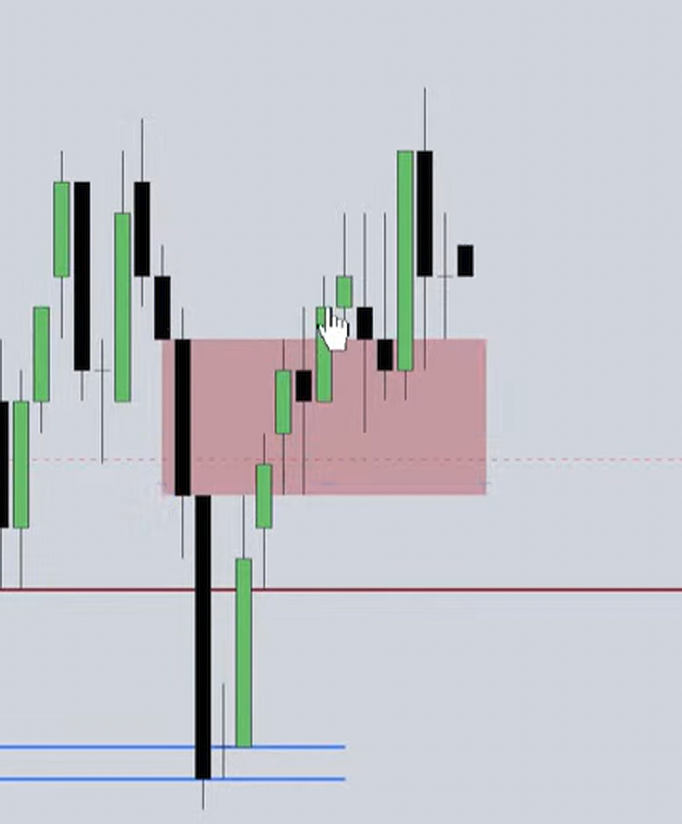
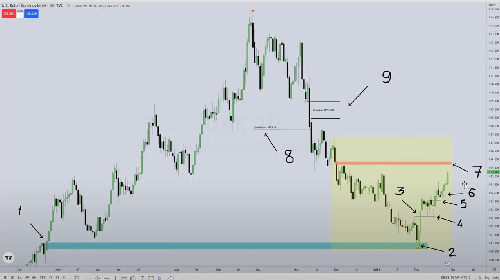

# ICT Mentorship 2023
This is my ICT 2023 Mentorship notes in reverse (descending by date) order.

## 2023

### ICT Mentorship 2023 - Proper Learning & The Importance Of Journaling
[ICT Mentorship 2023 - Proper Learning & The Importance Of Journaling](https://youtu.be/FQqwmDJOtxk?feature=shared)

This is a crucial video where ICT showed how to journal

### [Tuesday May 23, 2023 Forex & Spooz Market Review](https://www.youtube.com/live/hcSGlyfgKgA?si=hyMnLnXKVG523L5t&t=1570)

How does ICT know if FVG will not be filled or should stay open?
He simply saw how on a Lower TF gap was already balanced and inside a bigger TF gap there is a Lower TF gap, which is
going to be targeted by ICT

Again, how to know if HTF FVG (for example, -FVG 5m) won't be completely closed?
If on an LTF (for example, 1m), inside that bigger FVG we see back-and-forth movement... Then it means that price was
already efficiently delivered (but on 5m TF it was just a Bearish candle). So we want an upper portion of that -FVG 5m
will stay open

Another way to detect when FVG can stay open or not fully closed is:
When we have balance price range created by forming two FVGs: Bullish and Bearish (when it one single pass between two
middle FVGs candles). Meaning price was already efficiently delivered.

### [NQ Futures Review & The ICT Sick Sister Consolidation Model](https://youtu.be/VSSwM6rDIg0?si=RkB5d8DUwFt7DrL7&t=32)

We can use The ICT Sick Sister concept to choose the right market to trade (ES or NQ) depends on market symmetry
(ES/NQ/YM)

Sick Sister is similar ro SMT Divergence...

When we are looking into the economic calendar and see that Wed, Thur or Fri has high impact news, we can expect that
Mon and Tue will be consolidated days of that week. Meaning price will be moving in some no n-wide range.
We should be more nimble and more verst in market symmetry

When we have two NWOGs close to each other, then we might expect some consolidation...
In addition, if we have high impact news on Mon, Thur and Fri, we can expect market consolidation on these days or trade
in range...

For Consolidating Market:

* If YM and ES make Higher High, but NQ makes Lower Highs, and it's a consolidation, we can expect that NQ will drop
  into discount and then will also make a higher high. While ES and YM (who did highs) will not be moving so high
* So we are looking to a one Market from ES/NQ/YM to make a Higher High or Lower Low, like with SMT Divergence... But
  with Sick Sister approach, we're expecting that it will try re-do same (like ES and YM did), but later on
* We should focus on the weakest one for your Longs or the Strongest one for your Shorts trades

### [NDOG - New Day Opening Gap - Part 1](https://youtu.be/Sh-bDHWNpsk?si=jkxw4EjZ186wP2_l&t=18)

NDOGs are also not random

Minimal len is 1 handle for ES (4 handles for NQ)

We aren't interested in any previous weeks NDOGs, only on current week NDOG is interesting, as soon new week started we
should find the Current NDOG and extend it to entire week. We do so to see how this Gap will use our idea of Support or
Resistance for market price.

### [NWOG - New Week Opening Gap Part 2](https://youtu.be/BM1mqQv-ypk?si=v_tuVvIigq2SDSHd&t=639)

NWOG are not random

NWOG signatures:
* It can consolidate
* It can trend

If price is move away sharply down or up we can expect big movement

If price is bounce up and down between NWOGs then its consolidation...

There are Current NWOG, it will always be referred to previous week close Fri at 16:00 price and previous week open Sun
at 18:00 price

If price has unwillingness to move away and just keeps coming right back to that Current NWOG. Then we will probably
consolidate, so we have to be a scalper and nimble on our trade and to not expect to be trending...

By themselves, we should not expect that price will go into these NWOGs. We just should use it in our analysis and
incorporate it with other ICT tools (Code content or 2022 model) to make Trade decision

Algorithm will use NWOG as a magnate for a price

If we have two NWOGs and let's say we are Bullish, and we think the price will go higher. As soon as Price reaches
mid-point between these twp NWOGs we can assume with high probability that price will reaches NWOG which is higher...

How many NWOGs to keep on the charts? In the beginning 5 or 6, but according to IPDA data ranges: for the last 60 days

### [ES Review & ICT Funded Challenge Discussion 05/04/2023](https://youtu.be/F509lJRrYIM?si=ieuKnhXXFLSVlpIy&t=170)

Sell in May and go away.

Usually in May to 1st/2nd week of Jun we are Bearish in Stock Index Futures.
In spring (not always) Stock Index intended to go Lower.

The Same way we are Bullish from fall months going into the end of the year, the for st week of February

But we have to add some technicals to it, so let's talk a little bit about it...

We should not use all ICT tools we know, we should use not many within our model.

So we shouldn't trade on Thursday and Friday of Non-Farm Payroll week, like in Friday (May 5th, 2023); typically it's
the first Friday of the month.

### [April 13, 2023 Live Tape Reading - Emini S&P AM Session](https://www.youtube.com/watch?v=gGxVE8zUIRQ&list=PLVgHx4Z63pabpjlduWBaEsn8VMtALhjGV&index=48&ab_channel=TheInnerCircleTrader)

Narrative is the understanding:
* What will the algorithm do next?
* Why will it do so?
* And when it will do that?

We would like to try to find initial FVG on (OR) opening range (1st 30 minutes of trading).
This OR will provide us initial resistance or support, so we will wait when ES/NQ/YM gets in sync:
* If DXY goes lower, then ES/NQ/YM could easily go higher
* If that's not happened, then we find that DXY is consolidating
* When DXY is consolidating then we can go long ES/NQ/YM
* Consolidating DXY is not Bullish DXY, so if DXY goes higher we definitely don't want to go long on ES/NQ/YM

Classic Weekly Bullish Profile would be:
* Tue is a Low of the week in London
* If we are in Seasonal Tendency for ES when it's going Higher for the next couple of weeks
* We should be trying to do our analysis with mostly trying to look for the Longs
* And we are trading on Mon, Tue and if that Low really hasn't materialized in stunning fashion by Wed NY.AM SB,
  then the tendency for us to capture a huge move is by using that Weekly Profile

Those 👆 SB trades would be a phenomenon. Because what we are doing, we are participating in HTF price run on a weekly
expectation inside a Seasonal Tendency that is in alignment with a side of the trade we are taking (by HTF trend).
Whenever it's **Bullish Seasonal Tendency** or **Bearish Seasonal Tendency**

### [April 11, 2023 Live Tape Reading - Emini S&P AM Session](https://www.youtube.com/watch?v=VLis0LcbUaQ&list=PLVgHx4Z63pabpjlduWBaEsn8VMtALhjGV&index=46&ab_channel=TheInnerCircleTrader)

**Volume Imbalance** is influencing unless it hasn't been crossed with a candle body and then was closed.
When candle with a body has go through it, closed nd moved away - we can forget about it like about mitigated FVG.
Otherwise, we watch on how price will react on it:
a) will it respect VI and cross it only with wicks and then price might come back into this VI couple of times;
b) or eventually it will cross VI with candle body and price is moved away for it, so we can forget about that
particular VI...

**Top-Down Analysis.**
We should respect higher TF where VI was form, if it was 5m TF then we should ignore any candles bodies crosses and
closes that VI on lower TFs, we should wait for confirmation on higher TF where VI was form.

**Bred and butter setup.**
Let's try to find bread and butter 5 handles setups first and get confidence with them.
Next step is that we can try to trade outside on Killzones. For example, we can even try to trade NY.Lunch hour, but we
should know and always follow rules along with that: NY.Lunch can run against stops and those individuals who are
profitable for NY.AM, so Market knock them out and then can continue a trend...

**When should we enter into trade?** Only if framework potentially offering us at least 10 handles, then we can trade with
proper risk and try to get our 5 handles.
Why 10 handles?
a) because it allowing you a lot of forgiveness to enter a little bit early or a little bit late;
b) and because it will filter bad trades where you probably will lose...

**Inter-market relationship** ES, NQ and YM.
Easier more high probability setups can be found when all 3 Markets are moving in tandem.
For example: easily moving higher E, easily moving higher NQ and easily moving higher for YM.
If Markets doing different things (NQ moving lower, ES sideways, YM higher) then trade can be much difficult

**Balance Price Range.**
Once price moved into BiSi FVG lower and closed lower, once it did when that BiSi becomes balanced price range, that
means it's going to stop price up-moves like a brick wall stand in a way of price action: not allowing price to go
higher

Also for high probability trades it's very good to see how Dollar Index (DXY) supporting your idea with directional bias

How many partials to take? 50% or more if ES, NQ and YM are decoupled (not in tandem). Not the lowest part, but the
highest or half.

**How to trade NY Lunch?**
During lunchtime 12:00-13:30 price typically (not always, but typically) run against those individuals who where
profitable from this morning, meaning it can go against profitable traders stops. Where was the move? If move eas lower
during NY AM from A-high down to B-low. So ask yourself where algorithm will reprice to introduce that liquidity to the
marketplace? It's old short-, intermediate- and long-term highs. So we wanna annotate our chart with these liquidity
levels.
We have NY Lunch Macro: 11:50-12:10. Usually there will be a price run that runs the liquidity that goes against the
daily range. Price will run to the liquidity that will be used to protection purposes what was utilized in delivery of
the morning session. In layman's terms (from non-professional point of view) that was happened in the market since the
morning: 1) At 9:30am-10:40am price dropped, so Short was profitable. 2) At 11:50-12:10 starts Macro (short list of
directions that the algorithm itself will start operating under) it's runs on Stops, it offers Liquidity to the
Marketplace

When Market price reaches Liquidity levels we want to see speed and distance, if it were to do that we want to see how
price will reach next Liquidity Level / PD Arrays

### March 31, 2023 Live Tape Reading - AM Session
[March 31, 2023 Live Tape Reading - AM Session](https://www.youtube.com/watch?v=DNi9S3_NA44&list=PLVgHx4Z63pabpjlduWBaEsn8VMtALhjGV&index=45&ab_channel=TheInnerCircleTrader)

NDOG (16:59-18:00) will basically act similarly to NWOG

When price is spotty and messy we should train our patience

To begin with market run we can start with 5 handle run in between 10 o'clock and 11 o'clock:
* First question is: Where is Draw On Liquidity? Otherwise, without that question it doesn't have sense to open a trade
* We also should no open a trade if we cannot identify where is low risk and high probability (when everything is high
  risk and low probability), i.e. it's not obvious to determine where is stops and where is liquidity (where do you go
  in?)
* So it has to be absolutely obvious what Market is going to reach for? (inefficiency, Buyside liquidity)
* Market should tip his hand in form of displacement to show us what is going to do, unless there are no FVGs with
  displacement, there are nothing to do, meaning it's low probability
* Knowing what we are looking for (for example FVG with displacement with MSS or after Raid Stops to reach some
  liquidity during SilverBullet) it's easier to wait
* We should anticipate, but not reacting on a price
* In symmetric Market: +FVG/+VI will be best supported with idea ES going higher if DXY lower, higher high NQ and for
  example DOW not making higher high and thet might provide a fuel to ES going higher
* To invalidate our bullishness we should use 3 PD Arrays, gor example if price retrace lower than +VI, +OB and +FVG
  then it might invalidate our long trade idea, in general we want 3 PD Arrays should stay lower, then price for Long
  trade

For -FVG invalidation we can use the fact that candle body is not permitted above -FVG, wicks permitted - they do
damage, but as soon candle body has been closed and next candle goes higher (see mouse cursor) then trade can be closed
with a loss:

So if we are in Short trade and we placed our Stop tick above left high, and candle closed above -FVG which should be
a resistance then its a warning for us that our stop is not safe and Market ca revisite it, so we have possibility to
close that trade and get less loses

Inter-market relationship - it's important to observe all Markets: ES, NQ, YM, DXY, EURUSD, GBPUSD, ZB, ZN, ZF to have
complete view on what to expect and it should suggest where price is should go, lower or higher...

### March 30, 2023 Live Tape Reading - AM Session
[March 30, 2023 Live Tape Reading - AM Session](https://www.youtube.com/watch?v=LN1nfYp4dBw&list=PLVgHx4Z63pabpjlduWBaEsn8VMtALhjGV&index=44&ab_channel=TheInnerCircleTrader)

We are waiting specifically more for 10:00 hour to begin giving up the 1st 30 minutes of trading in the opening
range, waiting for more information and being completely willing to miss te move.

When ORG opens higher, and it is big, meaning we have a lot of premium in it, so we should pull quadrants fib
to be mindful of potential run when we might do down, event 1 or 2 quarter can be quite good ...but we should
see what will be in the 10 o'clock hour.

If we are on Thursday and its trendy day and if for example ES with NQ making higher highs, but YM making did
lower high then it's good to keep in mind than Thursday generally tends to create the opposite end of range.

Never short anything when it's going higher unless you had a confirmation. Keep the rules and do not improvise.

Existing relative equals lows or gap below Bullish Market doesn't make a price go lower if it has unfinished
business above, so do not short if Market is going higher and there are Liquidity or key reference point hasn't
been reached yet

If Market is going higher, and we are not know where it might go higher it's better to miss a move then being
wrong and simply push a button...

Model 2022 + SB (We are expecting 5 handle ES run every day) rules and algorithm:
1. When market opens identify Liquidity before SB start. At 0950 Macro time we are looking for run movement
   starts. Remember: run movement starts != run starts
2. During SB, we are looking for MSS with displacement
3. Identify FVG which is opposite to direction (+FVG when we're Bullish or -FVG when we're Bearish) we are
   anticipate Liquidity to be drawn to

For example:
* If we are Bearish: after Displacement lower we wait for price to trade up into that -FVG and then trade
  towards Pool of Liquidity lower in a form of Sellside Liquidity to targets with at least 5 Handles run from
  3rd candle high of -FVG on level where that -FVG was form
* If we're Bullish, then we are looking for Market to trade higher, Displacement higher, leave a +FVG below
  Market price, then trade down to +FVG and then gravitate towards a Pool of Liquidity which would be Buyside
  that hasn't been engaged yet, and it has to have better than 5 handled in terms of range from where we think
  it might get to

We should trade demo until we no longer we need to feel right, we should follow the rules. If we focus on
feeling right instead of focus on following rules (whatever the outcome is, we're still following rules),
then we are not ready to trade live funds. First we should be able to follow the rules even if results are
not so good, and only after the moment when we found that we can trade and catch 5 handles move no matter
how many trades we were success and how many not... keeping proper risk management with rules is the key.
For example, we take partial profit here and only then we move my stop loss on break even, we are never
move our stop loss or trail it... once we set stop loss its never increase a risk, its only reduces. If
we're feeling that we opened trade with too little risk it's better to close a trade instead of increasing
a risk

Task for homework: open 1D chart and find all swing highs and lows, and for each swing find where NWOG was
formed and where algorithm is accumulating positions (meaning it have be hard and choppy...) Do not keep
all NWOGs, we need only last 5

Seek and destroy day is when you trade long and it's gets stopped, then you trade short, and it's also gets
stopped. You say: Okay, I was wrong, now going long, and again, you got stopped again... Then next time
Market go in your favor leaving you without trade demoralized...

So if NY.AM session blows - okay, no problem, I'm done. I'll come back at 15 to 2 and I'll study and look
at the price, and it doesn't show me anything by 14:30 I'm not spending the rest of the day and even a
last hour. That the procedure we should follow

### ICT Emini S&P 500 Review - March 27, 2023
[ICT Emini S&P 500 Review - March 27, 2023](https://www.youtube.com/watch?v=NkwqJBzgQwo&list=PLVgHx4Z63pabpjlduWBaEsn8VMtALhjGV&index=43&ab_channel=TheInnerCircleTrader)

ORG can be useful when:
* Opening Range Gap is higher (meaning we opened higher than yesterday's session close price) then Market can
  return lower to yesterday's session closed price to re-balance or to reach discount PD Array
* Opening Range Gap is lower (meaning we opened lower than yesterday's session close price) then Market can
  go upper to yesterday's session closed price to re-balance or to reach premium PD Array
* Or it may return only to C.E. of that ORG.

When we are Bullish and when we have 3 swing lows which showing us intention go higher and where the lowest
swing is in a middle, then we can measure Standard Deviation projection from latest swing low to previous swing
high. In this example from STL2 to STH2:
```               STH2        /\      ...
\      STH1        /\        /  .    .
 \      /\        /  \      /    .  .
  \    /  \      /    \    /      .
   \  /    \    /      \  /
    \/      \  /        \/
   STL1      \/         STL2
             ITL
```

When we in consolidation od Daily chart, one possible case for trade on NY PM session on reversal after Key Level
was reached is wait for MSS after 13:00 prior to run stops of NY Lunch session.

Best Long positions will be below NY midnight opening price.
Best Short positions will be above NY midnight opening price.

We should not forget about Macro (09:50-10:10, 14:50-15:10, PM session last trading hour) during these macros
algo can seek liquidity or deliver price to key levels.

### March 21, 2023 Live Tape Reading - Conquering Your Fear Of Entries
[March 21, 2023 Live Tape Reading - Conquering Your Fear Of Entries](https://www.youtube.com/watch?v=hQ379EuyNKQ&list=PLVgHx4Z63pabpjlduWBaEsn8VMtALhjGV&index=42&ab_channel=TheInnerCircleTrader)

General rule: skip 1st 30 minutes (9:30-10:00) while forming Morning Session's OR (Opening Range) to complete
because it can be Judas Swing (fake move).

ORG (Opening Range Gap) 16:00-9:30. If we opened higher, we are wait for trap (meaning price go higher
but fail go higher next and can drop inside our ORG. I may just touch it or close 50% or close completely,
we don't know, but this is ideal scenario for us, it's potential opportunity and it's repeat.

We should always look at the Dollar Index to let it keep us out from wrong trades entries.

We should also look on ES, NQ and YM for divergences. When these markets are forming SMT Divergence we should
know that algo is tipping its hand, meaning that it's telling us that this rally is suspect rally, meaning
it's only going up to take Buy stops of anyone that short.

### NWOG - New Week Opening Gap
[NWOG - New Week Opening Gap](https://www.youtube.com/watch?v=WKKnlIIkBTk&list=PLVgHx4Z63pabpjlduWBaEsn8VMtALhjGV&index=39&pp=iAQB)

When analyzing NWOG, don't use daily charts, use something like 5m charts.

Use Fri closing price.
Use Sun opening price.
And C.E. in between them

ICT NWOG it's a tool with is giving information on large funds fair value meaning the market will gyrate in
between current and previous NWOG.

NWOG it a real liquidity void there is no trading there, so when market moves away from that after re-pricing
into it, it can refer back to it weeks ago, a month ago or more. So we need to keep at least of 5 of them on
our charts for proper perspective of large funds valuation.

If we are moving around current and previous NWOG then we are in consolidation. If in a trending days we are
moving away from current NWOG then we might expect to get back to it later.

There are two NWOGs, and we should prepare two templates in our TradingView for these gaps:
1. NWOG Actual, which is forming from Fri 16:69 closing price and Sun 18:00 opening price.
2. NWOG, which is forming from Fri 16:69 closing price and Mon 9:30 opening price.

By looking on a difference between these two NWOG and NWOG Actual we can learn how fair valuation is utilized
during the week and/or even month.

### March 08, 2023 Live Tape Reading \ Fed Chair Testimony 10am
[March 08, 2023 Live Tape Reading \ Fed Chair Testimony 10am](https://www.youtube.com/watch?v=4H74nXabvL0)

Once we reach a weekly objectives we should stop.

The weeks of Non-Farm Payroll which is typically not always, but typically the first Friday of every month,
so we don't trade the day before, and we don't trade on that Friday because the probabilities for precision
fall off precipitously. So protocol for such Non-Farm Payroll weeks is next: our task as a trader is to get
all our business done on Wednesday NY.AM, once it's 11:00 - it's over, we are done.

Inside us 3 people:
* analyst - person in charge of what we're going to be doing? Buying or selling?
* trader - the person who is going to be doing engagement itself with timing aspect when we are pushing
  the button, managing the risk, using the logic that being leaned on as the analyst
* gambler - this person we should keep out of driver seat and hold away from trading in these two days,
  because gambler is want to see what will happen if we will push the button

NWOG it's a true dynamic FVG. So market algorithm does is deliver price in it to offer fair value to
marketplace, not necessary for us, but for large funds and SM. Once price goes here large funds either
come in or get taken out.

1) Market goes up for Buy-stops or re-deliver into inefficiency like FVG upper. That it: it's either going
   up for that reason for long to sell their long positions too, or it's going up to start a new sell-off
   so in that way shorts can be implemented, and then it's going to be looking for an opposing liquidity
2) Market goes down for Sell-stops that hold below an old low, or it will goes down for an inefficiency,
   or it's going lower to start new buys, so in that way longs can be implemented, and target objectives
   will be opposite Buyside Liquidity
3) If it's not doing that, guess what it's doing - it's consolidating. Usually consolidation is happening
   ahead of big news, so we don't trade in consolidation

When we Bullish then we are looking for 2 things: a) it's going up for Buy-stops - above a high or relative
equal highs, or b) it's going up for Premium Fair Value Gap - some kind of inefficiency where market has
dropped in a previous as far as 60 days back, some old high, some old price decline where is a FVG, it's
going up to that level to re-price. That's the only two reasons why price is going to go up.

The market will where money is. If there are no money they will engineer it.

### March 07, 2023 Live Tape Reading \ Fed Chair Testimony 10am
[March 07, 2023 Live Tape Reading \ Fed Chair Testimony 10am](https://www.youtube.com/watch?v=wu0sQarBRrI)

We should always think like so: if I would control market price, whe would I steer a price to and why?
So what we need to do is annotate on 5m and 15 m timeframes liquidity pools that hasn't been reached yet.
Its formation can be related to previous day or earlier... So SM, algo and those who controls price, they
will go where wouldn't be too much to expect to reach those lever with liquidity pool (too clean, too
smooth retail support/resistance levels, old lows/highs, FVGs, order blocks, etc.)

When we annotated both (Sellside and Buyside Liquidity Pools) 2nd thing we will do - we can study and
watch which of these levels market will reach first.

If market will take Buyside first, then we should see if it is going to reach opposite (Sellside) Liquidity
and vise versa...

It's not about be right or wrong! It's not yet about trade setup. We should view this as a personal
exercise in observation, so in that way we are not just looking at the chart blindly, not knowing what
we are paying attention to, what's relevant to us... It's just helps us with reading the tape and reading
the tape it's not about pushing a button, and it's not about trading... it's about observing price and
getting feel what it's doing right and that's experience chart times, it's how we train ourselves with
online charts price data.

When we have price in between two NWOGs and it reaches mid. point, it's always reasonable to expect that
price can reach that NWOG its moving towards.

We shouldn't regret if we did not catch some move. Big moves happens very often. This is a way of forging
of patience and self-control.

We should be not afraid of using stop lose.

If we see like DXY made a higher high, but ES not make a lower low then we can expect that ES should
eventually make lower low... But, if YM made lower low and ES is not (+SMT Divergence ES), then we can
expect short-term consolidation or even potential reversal.

In other words, if we are in a position and for example YM is making a lower low, but ES with NQ is
not then we should take ofo more than half of our position, because it could mean it could create a
replacement higher against the position that would have open.

If later after ES/DXY Divergence will be declined, meaning markets back to symmetrical behavior, than
we can assume that markets movement are in sync, and we can expect normal, not unexpected.

### March 06, 2023 Live Tape Reading \ Baseline 1 of 3
[March 06, 2023 Live Tape Reading \ Baseline 1 of 3](youtube.com/watch?v=n37ozsUreR0)

We're going to do wrong. So baseline measurement 1 of 3 Drawdown Mitigation & Rebuilding.

Do not trade on Non-Farm Payroll, Federal Funds Rate, FOMC, CPI, PMI, etc...
See: https://www.forexfactory.com/calendar

Opening Range (OR) it's 1st 30 minutes of trading (09:30-10:00) and we are not trading during this
period of time. We are wait for 09:50 macro to see how market will reach for liquidity or reprice
inefficiencies and when market will show his hand we can try to trade next hour NY.AM Silver Bullet
in between 10:00-11:00 o'clock.

On ORG if we see ES or NQ price is above it and making higher high, but Dollar Index is not confirming it
with lower low, then we might expect that price will pull back into this ORG.

OR (09:30-10:00) it is not a ORG (16:00-09:30) or NDOG (16:59-18:00) or NWOG (Fri 16:59-Sun 18:00).

In HRL run conditions the market is in no hurry to get to an opposing discount or premium array. Because
liquidity or inefficiency is encapsulated be that idea. Where in environment like a LRL run it's in a hurry
very quickly to get where it wants to go (reach opposite premium or discount array).

In HRL run conditions market is no hurry to reach opposing PD Array (choppiness or consolidations...)
In LRL run conditions market is in a hurry to reach opposing PD Array (big candles or push-push-push...)

We should always take partial profit, or close a trade if there are only 1 contract to not allow us to be
frustrated by think to being right and loose money instead of taking some money. Risk management is #1.
Period.

If we're expecting price go higher, then down close candles should support price.

SMT: If YM made a higher low, but ES or NQ made a lower low, then it's SMT Divergence.

### February 25, 2023 Market Commentary
[February 25, 2023 Market Commentary](youtube.com/watch?v=kFIOp8Tprdc)

Before trading week routine:

Here 👆
* 1 - +FVG (Bullish Fair Value Gap)
* 2 - Price retrace into this +FVG Consequent Encouragement (C.E.)
* 3 - +MSS (Market Structure Shift)
* 4 - Price retrace into +BB (Bullish Breaker)
* 5 - Price retrace into +OB (Bullish Order Block) which is candle with lower body
* 6 - Price retrace into +VI (Bullish Volume Imbalance)
* 7 - We expect price will reach +VI higher
* 8 - We also can expect that price should at least touch Equilibrium (50% or Dealer Range)
* 9 - Finally our expectations is that price can potentially reach -FVG (Bearish Fair Value Gap)

On a weekly charts each Saturday or Sunday we should anticipate where candle is likelihood should expand,
lower or higher? - This is our weekly bias. Benefit of doing this is our orientation for lower timeframe,
because we will know what we will expect from price, so we submit ourselves to believe that price should
go in our direction according to our biggest odds and our idea comes from weekly and daily charts...

HRL (days with lots of chop) vs LRL (days with big movement candles): We should learn when whey are occur
to focus on LRL for our trades.

When we see that price did big movement prior to 9:30 then we should expect that at lease NY.AM session
(but maybe and NY.PR) will be choppy. We gonna miss some moves and it's okay.

-BB (Bearish Breaker Block) can be treat if price was closed below Breaker down close candle, so even
if price did -MSS and has -FVG upper we should not expect that price will come back up to that -FVG, but
if we see -VI lower than -BB or -FVG, then we can expect that price will just touch -VI and drop lower.

Engineered Liquidity can be formed for example near old relative equals highs, when we are not swept it
and form -BB initial down move candles to make believe retail crowd that they must sell shorts, so on
next -BB upper move we will take their buy stops (break all short traders).

-IOFED is when market touched a little bit -FGV and drops.

In bearish market every time when market goes up it's returning to take buy stops or repricing
inefficiencies.

Wicks are inefficiencies, so we can expect price reach mid. point of these wicks C.E.

Dress your charts correctly.

We can use SMT not only with highly correlated markets but also USDX SMT. For example if ES made a higher
high and in according normal situation DXY should do lower low, when DXY wasn't able to make lower low it
is USDX SMT.

### ICT February 24 - Conquering Fear Of Being Wrong Vs. Profitability
[ICT February 24 - Conquering Fear Of Being Wrong Vs. Profitability](https://www.youtube.com/watch?v=qUYWVwyRhZs)

Market Structure Shift (MSS) is short term change in market sentiment and it will deliver on a short term
basis. MSS doesn't require close above a STH, its just need to trade above it.

Market Structure Break (MSB) is where entire trend in marketplace changes, and we're going into longer higher
timeframe delivery of the price (where if its bullish, and we have MSB that is bearish, then we would say
that is change in trend, aka reversal).

Once MSS occur algorithm will start a macro for price delivery.

Macro is a short list of instructions that algorithm will run in a price engine which creates these
fluctuations in price action, and it doesn't matter what buying and selling pressure currently is.

+SMTD is only confirmation tool that showing that Sellside Liquidity was taken, and we're going higher if we
are bullish.

You do not ever want to be trading ahead of CPI numbers, it will rip your face off.

When we're watching +OB, we are looking on its high and Mean Threshold and expecting a reaction higher from it.

Bullish Propulsion Block its nested OB within another OB.

### February 16, 2023 ES Opening Session Commentary
[February 16, 2023 ES Opening Session Commentary](https://www.youtube.com/watch?v=KXx07qzW5u0)

New Week Opening gap (NWOG) is gap between 16:00 on Fri and 18:00 on Sun.
New Week/Day Opening gap (NDOG) is gap between 16:00 and 18:00 of current.
Opening Range Gap (OR) is gap between yesterday's 16:00 closing price and today's 9:30 opening price.

If we had news drivers and big run before 9:30 then we can expect price choppiness and/or run against
profitable traders (who was able to catch this move) stops. For example after bin market drop if we're not
going to go lower ask yourself "where is the money?" right, - higher buyside liquidity on bearish
inefficiencies, order blocks, or previous highs, or relative equals highs...

Breaker Block is: Low, Higher High, Lower Low, retrace to block and go higher. Mitigation Block its
almost opposite to Bullish Breaker Block: Low, Higher High, Higher Low, retrace to block and go higher.

If we want to confirm that our Bullish Breaker Block invalid - price should at least go lower through it
and then back upper, so Breaker will act as resistance (similar to -iFVG).

### February 15, 2023 ES Session Review
[February 15, 2023 ES Session Review](https://www.youtube.com/watch?v=SSWN6YSVyFY)

NDOG (New Day Opening Gap) is price in between 4:59pm market close and 6pm market open it's a reference
point where algorithm will refer and come back later.

The Bodies tell the story, the Wicks do the damage.

If we expect that market is going to be hard to read (for example due to high impact news), we can trade
on 7:00am-8:30am to utilize that interval during pre-market before news driver (medium to high impact
news) and expect that we can reach our target at 8:30am.

Symmetrical market is when for example we have lower low in NQ and ES and higher high on DXY. This is
we want to see to trade, if at any time we see non-symmetrical market we want to step away because of
sentiment shift unfolding. Example: if we for example cannot see dollar index higher high when it was
expected - it's a dollar index divergence, and it's a signal for  smart money, so they probably will
seek for liquidity (external - Buyside or internal - 50% of dealer range, bearish gaps or blocks...)

Buy model on last hour macro 15:15-15:45 after stops (liquidity) has been taken is not a Market Maker
Buy Model is when market starts booking higher price until we get a pool of liquidity (Buyside
liquidity) or premium inefficiency (FVG SiBi)

Order Block it's a Change in the State of Delivery.
Order block start on opening price of consecutive sets of down close candles after its validation.
Order Block is valid as soon as upper close candle goes 1 tick above Order Block.
Order Block is fair value, it means that algorithm with offer that fair value to the Smart Money.

### February 15, 2023 ES Live Commentary AM Opening Session
[February 15, 2023 ES Live Commentary AM Opening Session](https://www.youtube.com/watch?v=8YSVu51hUWQ)

We should always look on multiple chArts: ES, NQ, YM, DXY. All markets should agree:
if Dollar is going higher, then we are looking for short setups on indexes (risk-off mode);
if Dollar is moving lower, then we are looking for longs on indexes (risk-on mode)
