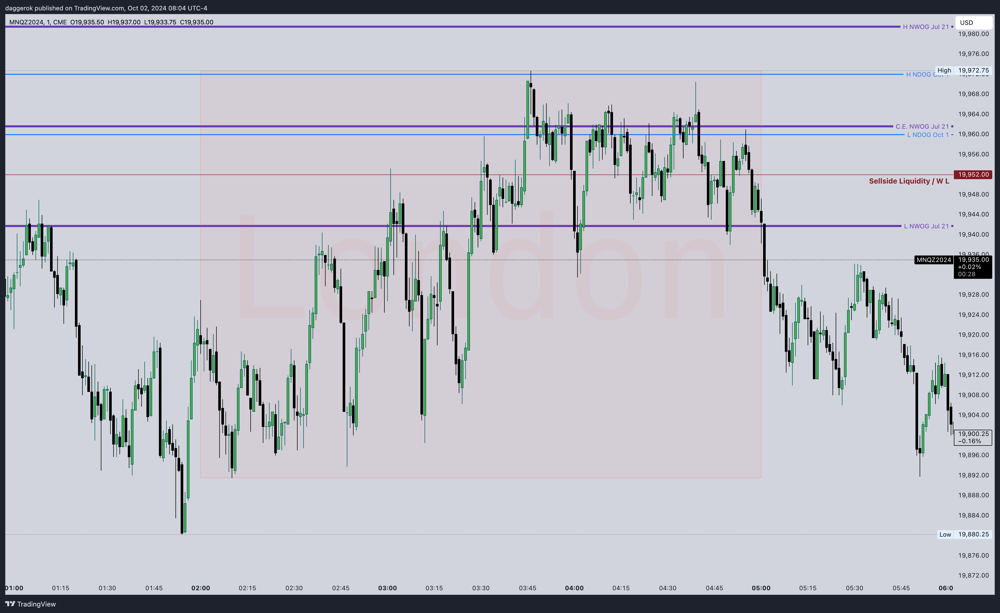

# ICT Mentorship 2024
This is my ICT 2024 Mentorship notes in reverse (descending by date) order.
I started to learn it at the end of 2023, but the topic is quite big and complex.
ICT said that hist students should make a notes because it's not realistic to keep everything in memory...

## 2024

### ICT 2024 Mentorship \ Premarket Tape Reading NQ Futures \ October 21, 2024
[ICT 2024 Mentorship \ Premarket Tape Reading NQ Futures \ October 21, 2024](https://www.youtube.com/live/CQk-5lAirn0?si=XylTo0e5W50fvSay)

When its day like a Mon without volatility injections (news) we always should mark previous days / sessions highs and
lows

### ICT 2024 Mentorship \ NQ Tape Reading \ October 15, 2024
[ICT 2024 Mentorship \ NQ Tape Reading \ October 15, 2024](https://www.youtube.com/live/HMn46vLjKvY?si=Sl3stZB3vFnlkTav)

When we are in consolidation, meaning we are inside yesterday's range, we should mark quadrants with a Higher High and
Lower Low in between 12:01am and 4:59am. This is called Overnight Range. This will help us approximately predict where
PD Arrays may form.

When we see tiny ORG (less than 75 handles), its signal for us that price will be choppy and hard to trade...
So we have to wait for 10am for SB. We are wait for FVG form and liquidity.
If it doesn't have a clear bias, then we sit still and wait for the next opportunity:
* either on NY Lunch macro
* or MYpm SB
* or Last Hour Macro (LHM)

When we are looking for liquidity of the previous day, we should look at prev NYpm high and low, but also we are looking
for liquidity at between 1:30pm and 2pm

We should mark every single last week day highs and lows

### ICT X (Formerly Twitter) Space | The Trump Card & 2025 Trading Education Landscape | Nov, 09 2024
[ICT X (Formerly Twitter) Space | The Trump Card & 2025 Trading Education Landscape | Nov, 09 2024](https://youtu.be/8Dk7qQh5qrg?si=7TYp2GuYN4-p9BGS&t=8804)

Important: Not apply every ICT concept, it's wors what we can do

Try this ICT model approach for my trading: We should understand current Market conditions when trading can be
straightforward (to know when to trade) and when trading is might be no so favorable (to determine when not to trade)
* 80%
  * Knowing when it will be High Resistance Liquidity Run
  * Knowing when it will be Low Resistance Liquidity Run
  * Knowing a Bias
* 20% is Time (Macros)

Most of the ICT teachings is all about this determination: when to trade and when not to trade.

1. High Resistance Liquidity run market conditions: [2:35:43](https://youtu.be/8Dk7qQh5qrg?si=Z68MdpkEI_Y7xUjr&t=9343)
   * When we are trading on a day, where no high or medium impact news drivers, because there is no manipulation, which
     is likely occurring (doesn't mean it's always like that, but most time that's going to happen)
   * When we see every FVG gets closed in and we spend a lot of time in those FVGs (more than just one time and leaving
     it): One down, then spend maybe two candles in it, then leave it and then come down and touch the upper half or
     touch just a top of it and spring away...
2. Low Resistance Liquidity run market conditions: [2:27:50](https://youtu.be/8Dk7qQh5qrg?si=qVLqnXR2lMAIqdwl&t=8870),
   [2:36:03](https://youtu.be/8Dk7qQh5qrg?si=Q7oNmHIPAtkVD3l8&t=9363)
   * So we should look for the conditions when the Market leaves open FVGs
   * We want to see imbalances to stay open (imbalanced), that means we can have faster price runs and fewer
     retracements 
   * There is high or medium impact news which means we will have some kind of manipulation, judas swing, or fake run in
     an opposite to a weekly bias direction
3. Bias: [2:29:12](https://youtu.be/8Dk7qQh5qrg?si=u5KFtGJL2obKeXN1&t=8951)
   * Bullish:
     * On a weekly chart the price just recently takes a Sellside Liquidity
     * And/or last week was down-closed week
     * And it looks like moving higher up to an imbalance and/or to short-term high (if both are existed, that's the
       strongest draw on liquidity)
     * So our Bias on a higher timeframe is Bullish — Don't fight that
   * Bearish: On a weekly chart
     * On a weekly chart it looks like run lower to an imbalance after Market Structure Shift
     * Where it just recently takes a Buyside Liquidity
     * And there is Sellside Liquidity below... Well, what It's likely to do? — Reach down
     * So our Bias on a higher timeframe is Bearish — Don't fight that

When price is opening and going down and our Bias is Bullish, we try to buy that drop down, and it's scary in the
beginning, but the only way to get comfortable with it is watching price, studying it, practicing with it:
Not trade or even demo this, only tape read, hypothetically say: I think it's going to stop here, and it shouldn't go
any further than this level here... And we are watching how price gets delivered inside those macros.
During that macro, there is going to be run on price that either going right into inefficiency or to take a Liquidity.
Macros designed to start that spooling process, it doesn't complete it, it doesn't mean that only move in those 20
minutes.

Knowing, when to trade [2:42:04](https://youtu.be/8Dk7qQh5qrg?si=lViS9ER8cqrdZE_A&t=9724), we want to trade in Low
Resistance, if we can filter out High Resistance conditions, we will be better equipped to staying in that business long
enough

So we want to predict Low Resistance conditions by economic calendar.

The Bias is going to be determined from a weekly chart, it is going to go for stops, or it is going to go into
inefficiency. And where was the most recent rejection because stops where hit there? And if we cannot determine it,
that means we don't have bias on a weekly chart... that means that we are either going to trade intraday volatility or
do nothing. That is better than losses, it's a good medicine for us to be patient and sit still


### ICT X (Formerly Twitter) Space | Romancing The Uncertainty | October 5, 2024
[ICT X (Formerly Twitter) Space | Romancing The Uncertainty | October 5, 2024](https://youtu.be/Nk34ayXn1mw?si=UbmBtJm4cjdD8KSX&t=6113)

Model:
* Start trading day at 9:30am
* If ORG is opening higher than the first 30-minutes bias is Bearish, otherwise if ORG is opening lower, then first
  30-minutes bias is Bullish
* Wait for the First Presented FVG and ise is as an entry
* For profit, targets focus on NWOGs and NDOGs or cluster of them, above Old High or REH when Bullish, and below Old Low
  or REL when Bearish as Draw On Liquidity
* Trade must be closed before 11:00am

### ICT 2024 Mentorship \ October NFP NQ \ October 04, 2024
[ICT 2024 Mentorship \ October NFP NQ \ October 04, 2024](https://www.youtube.com/live/qcYYm1iNCIM?si=EgmudceeCgakU3SH)

On high impact news, first 15 minutes we are not looking for inefficiency, we are looking for Liquidity, we want to see
which stops raided.
After 15 minutes, we can start looking at inefficiencies.

### ICT 2024 Mentorship \ Tape Reading NQ \ October 02, 2024
[ICT 2024 Mentorship \ Tape Reading NQ \ October 02, 2024](https://www.youtube.com/live/YxpHUwZhu80?si=A9zKA_VM_epsbZ01)

TODO: Look at that stream once again!

This week is Non-Farm Payroll Protocol week.
This means that price action will be less favorable.
We can see this by looking at on London session:


SM will be using Non-Far Payroll as excuses for volatility.
Do not trade on Wed, Thu, Fri in NFP weeks, we want to find setups on Mon and Tue, when the Market is clean

We can trade on Fri if we want, but we should wait for 8:30am to see OR, but we should never be in the Trade before
that

---

The Long-term trend in election year is usually Bullish

---

If we have BiSi with less portion not taken and then MSS we would like to see Stops Raided before the Price will go
higher...

---

Identify pools of Liquidity and expect to look at rage trading...
Meaning Turtle Soup can be used or expect that.
Opposite liquidity pools, it's better to be taken before every significant price run, because it will be easier to
trust that the price can go and take the opposite side of liquidity.

---

Before 9:00am, we were not looking at Primary Liquidity Polls. Why? We want to see what the Market will do in
the first 15 minutes. Instead, we're looking at higher TF, because the Market is already moving somewhere...
At 9:00 we will identify our primary pools of liquidity on 5m or on 15m TFs.
We don't care which pools of liquidity will be attacked, but we will be using it as catalysis for the next price run.

---

We can trade on Fri if we want, but we should wait for 8:30am to see OR, but we should never be in the Trade before
that

---

We should identify problem areas (days and/or specific time of the day) and do not trade to not blown an account

---

Minimum 15 minutes is the time we need to wait and see what will happen to news drivers

---

The Middle of FVG is crucial. If CE is respected, we should see this.
If it's not respected, we should sit still.
We can go in only if we see that CE is respected to the tick

---

We do not do enter on iFVGs, we wait to see if it will stop price and act as a resistance, and we enter on next
forming FVG...

---

OG its initial Bias. Meaning if it opened lower, the first 30 minutes, we are focus on longs.
Or at that point of time we've already identfied liquidity pools, so we can use that 50% mid-level of ORG as a turning
point to identified pools of liquidity

### ICT 2024 Mentorship \ Limit Orders & Volatility Pinball Drills \ October 01, 2024
[ICT 2024 Mentorship \ Limit Orders & Volatility Pinball Drills \ October 01, 2024](https://www.youtube.com/live/DnuCB5Stk-0?si=Sbw3k1LUsk8nYpRs)

Indigo Entry Model:
* Run on Sellside Stops (Purge of Liquidity, Bullish or Bearish)
* Order Block
* Volume Imbalance above the OB when we are Bullish, or below the OB if we are Bearish

Indigo Entry Model it's an OR inside of Liquidity

---

There should be only 3 key points in our module:

* Time: Why Price should move / why price has Moved? It should go up/down to take Liquidity or up/down to reprice
inefficiency
* TBD...

---

When we're treading iFVGs, we want to price leave it, and when it will come back (retrace) to it, bodies should respect
that iFVG C.E.

---

We don't trade before: FOMC, CPI, PPI, Non-Farm Payroll. All they at 8:30am delivery. Those are destroyers.
If they on Fri, then we can trade from Mon to Thu.
If its NFP week, we can trade on Mon and Tue. Last night London was terrible because of war in the Middle East.
Trading after high impact driver news it's okay and easy, but we should never trade before their release

### ICT 2024 Mentorship \ Premarket Concepts \ September 30, 2024
[ICT 2024 Mentorship \ Premarket Concepts \ September 30, 2024]()

Before FOMC and other high impact news, we should trade pre-market like from 6am till before news release...

Rule: wait for news release + 15 minutes after for high and medium impact news

### ICT 2024 Mentorship \ How To Identify High Resistance Liquidity Conditions \ September 27, 2024
[ICT 2024 Mentorship \ How To Identify High Resistance Liquidity Conditions \ September 27, 2024](https://www.youtube.com/live/l7eu9yvUUtg?si=JS7BUDgMYzSm8m8C)

Difference between Bias and Narrative:
* Bias is: Are you Bullish or you Bearish?
* The Narrative is when we think where price might go and why... For example, Today is Friday, and we had a Bullish
  week, so it's reasonable to think that price might take old lows (TGIF) even if its going to go higher later

ORG:
* if there is a big/large ORG (75+ handles), then we can expect good movement
* if we have small ORG, then we can expect back-and-forth movement...

When not to take trades? On HRL days.
When we have small ORG, then we might face with HRL

On a LRL days our stop can be a few ticks above FVG where we're entered.
On a HRL days out stop should be above twice of FVGs

If the price is spending a lot of time in inefficiencies, then we are in a HRL conditions.
It's not a chop, it's not a seek and destroy...
These conditions create Turtle Soup setups

ICT tells that it's easy to miss-think Seek and Destroy day with HRL days.
It cannot be 2 Seek and Destroy days in a week, it can be one Seek and Destroy and another HRL day...

The easiest way to identify that we are on HRL conditions is when we can see how price spend a lot of time in FVG.
We shouldn't revisit inefficiencies multiple times.
Inefficiencies shouldn't be seen with multiple candles laying inside them, over and over and over again...

In HRL conditions, we can study price to see how many Turtle Soups can be created...
Its all doing is coming back to get any trial stops, that is what it's doing...
That is the nature of what is happening behind the scenes of HRL conditions, it's running stops, because SM is building
and accumulating their positions for the next move

### ICT 2024 Mentorship \ Tape Reading \ September 23, 2024
[ICT 2024 Mentorship \ Tape Reading \ September 23, 2024](https://www.youtube.com/watch?v=Qg3O1GkJDeQ)

Mondays, we don't trade them in the morning. Better to come back and trade NYpm session, its SB or LHM

#### Questions
* What do you mean when you're saying "the way how it delivers, I don't want to see it trades higher"?

### ICT 2024 Mentorship \ CFDs Vs. Futures \ September 20, 2024
[ICT 2024 Mentorship \ CFDs Vs. Futures \ September 20, 2024](https://www.youtube.com/watch?v=Vo8WKYKtzIU)

Tags: #[ORG](), #[OR](), #[FistPresentedFVG](), #[Macro](), #[Macro0950]()

Since Today's Opening Price is Lower than Yesterday's Settlement Price (where we closed yesterday at 4:14pm), that
means we have Discount ORG

The First Present FVG it's the first FVG that appears during OR (between 9:30am and 10:00am)

We should extend First Presentation FVGs to the right for future trading, similarly like we do for NWOG/NDOG.
These FVGs will be influential at least 3 days.
Sometimes we will see how they can have an impact on price after 1 week or more, but at the moment we should use then
at least 3 trading days especially if the price is raging around of that.

The Opening Range (OR) is a time interval in between 9:30am and 10:00am

0950 Macro is time in between 9:50am and 10:10am when the Market can start spool price lower or higher

If ORG is small (less than 40 handles on NQ), it means that this Gap is Limp (not so influencing).
Especially if yesterday was a large range day.
Also plus if its Friday and we had big range week...

If we have big volatility, then we might not require waiting for Macro

---

When the Market is chopped during opening on OR, usually it's just time distortion.
What is time distortion? It's waiting for specific time (Macro)

---

With days like yesterday when price hasn't been even touched a huge ORG C.E, meaning we have a big Discount void that
hasn't been traded yet...

---

With weeks like that, when price goes higher and its Friday, then we might expect TGIF when price can retrace 20%-30%
of the total weekly range was

---

Summary, as a trading conditions:
* If we have quite a big ORG (at least 40 handles for NQ), then we can trade 70% probability of the fact that price
  will trade to C.E. in the first 30 minutes
* Else if we have not a wide ORG, then we can trade something like yesterday's First Presented FVG
* Otherwise, we can wait for NY SB and trade that

### ICT 2024 Mentorship \ How To Manage Missed Entries \ September 17, 2024
[ICT 2024 Mentorship \ How To Manage Missed Entries \ September 17, 2024]()

Tags: #[ORG](), #[FistPresentedFVG](), #[Micro]()

This lecture is about how to participate if we are missed the entry and how to participate in these kind of trades...

---

If we are going to trade a day before FOMC, we should trade it in the morning.
Why not trade on FOMC? This day is highly manipulated as before and after. 

TODO: To check if on FOMC at 2pm price will start go in one direction (higher or lower). At 2:30 pm it may go in
the opposite direction

---

High frequency trading with FVG and without Bias. The only we need to see is 5-minute TF charts for pools of liquidity.

### ICT 2024 Mentorship \ September 16, 2024
[ICT 2024 Mentorship \ September 16, 2024](https://www.youtube.com/watch?v=HhgWGduQZQY)

Important note on FVG:
* For Bullish +FVG 2nd candle stick should go higher, meaning 2nd candle shouldn't open with Gap on premium and go
  lower even if it's going to stay higher than first candle of +FVG

### ICT 2024 Mentorship \ September 13, 2024
[ICT 2024 Mentorship \ September 13, 2024](https://www.youtube.com/live/wEBlRM7whoI?si=N9oIkOOZUTvWi5GR)

Tags: #[NY.pm](), #[Friday]()

When it's before or during 2:50pm macro, ICT expects that:
* if STH or nearest Minor Buyside Liquidity is taken during that macro, then price might go higher up to rel.eq.Hs and
  it means that the Market is under big manipulation
* if STL or nearest Minor Sellside Liquidity is taken during that macro, then the same kind of continuation there is
  also possible
* of course, it can be sideways, so there is always possibility for what we are not expecting

When we 50%/50%, then we either should not to trade, or we require these conditions with macro when the Market tips its
hand to us.

---

Normally on Fri we have a large range of close weekly candle forming.
Also on Fri ICT likes to see from 20% to 30% retracement (TGIF). But it's not expected for this week, which is enormous
and was highly manipulated by going higher, higher, higher...
But it should move with displacement and all formed FVGs should stay open on half of it

Or we can stay inside NY.pm KZ range... If it happens, then ICT would really like to see the Gap Opening Higher on Sun,
meaning Premium NWOG. And then come down, work into that Gap as a closure... And then slowly bleeding into higher prices

Before NY.pm we should look at a range of NY.Lunch sessions, because it's giving us a context for trading NY.pm session.

---

When price is inside inefficiencies (like FVGs or VIs), ICT don't want to see price is stay in them.
If we notice that the Market is staying inside inefficiencies, we have to take a step back... Because what we're seeing
is time distortion. That Means that algorithm is in holding pattern (mode), and it's not going to move fast. It's not
going to do something crazy, it's just simply going to go sideways. And then people seeing this, they really don't know
what the Market is doing...

But ICT teaches us to take a step back and say: okay, where are inefficiencies? If there are no inefficiencies and
price is staying inside the only inefficiency that around price ride now during this time...
Meaning the Market is in a holding pattern, the Market is simply being controlled and held in time distortion...
Meaning it's just market time... It's not meant to make a new range high which would take a STH or take STL, until it
did it. Once it did it, ask yourself, what time of day is it happening? Macro? If it happens during the Macro...
Then, if it took Sellside first, and we are in a consolidating market, what it's going to do? It's going to explore
another side of that inefficiency, which is Buyside (prev. STH).
If it took Buyside first, then it's reasonable to expect that next is going to be taken Sellside (STL)
And when it will be hit, again check the time of the day... Is it Macro? :)

So the main takeaway from this is that time is the most important part of trading.
As soon as we see how price is reacting, we have a high probability that the Market is going to spool the Price to take
opposing liquidity.

---

How to use that strategy in our own Trading Model?
We're simply looking at Price Action and marking PD Arrays, inefficiencies, STLs and STHs...
When Price is taking liquidity during some Macro, it means that now it is very highly likely that Price will go and
take opposing Liquidity.
So basically we can either be more aggressive and enter into trade with Turtle Soup, or we can get not a best entry,
but have a sweet and short "Bread and butter" setup with target on opposing liquidity.
And we can do it all day long... Because every single hour there is a 20-minute macro... But during certain hours
of the day are not going to be all energetic because they are not designed to be energetic. But they're going to be
checks and balances that disrupt or entice a little bit sentiment of purpose of bringing liquidity, that's all...
Meaning the role of the Macro is to get retail engaged and took liquidity, so after that Smart Money could reprice
where its needed.

---

If we have PD Array (let's say +FVG), and price is failed to touch its C.E, this fact can tell us that we are really
Bullish. So we can expect that Price is highly likely to try to get opposing liquidity...

---

If we want to trade Asian session, we should never open charts at 6pm and trade. We should always wait around 7pm
and see if Price will overlap/overtop NDOG... But when we get into 8pm (that means 7:50pm to 8:10pm), that's a nice
little area to anticipate that 8 o'clock macro. And then you have it again from 8:50pm to 9:10pm. Those two macros are
really nice.

During the Asian session we can trade next Forex currencies: Aussie Dollar, New Zealand Dollar, Yen and Swiss Frank.
We should use 6:50 to 7:10 macro, 7:50 pm to 8:10 pm macro and also 8:50pm to 9:10 macro.

From 9:50pm to 10:10pm and from 10:50pm to 11:10pm macros are not so good, but...
From 11:50pm to 12:10am it's a dynamite macro, because it real / true new day macro

### ICT 2024 Mentorship \ September 12, 2024
[ICT 2024 Mentorship \ September 12, 2024](https://www.youtube.com/live/DRuEMX4RhMw?si=9SZLNmDA83km7XPh)

Opening Bell protocol: We mark ORG (4:59pm to 9:30am) and wait for it 50% fill in the fir st 30 minutes of trading.

If we are Bullish, and price is dropping into =FVG, then we would like to see that price should not close that
inefficiency completely, we would like to see reaction from the upper part of +FVG.

We are looking in pre-market (before opening) to see in price is support ORG.

We are looking for initial price Action after Opening Bell to have an idea about SB trade.

Keep in mind, that everybody saw rally yesterday, so everybody wants to do what? They want to chase a Bull run.
Smart Money in these cases can even not provide PO3 manipulation, and they might want to push price lower.
Because large ranges yesterday can bring excitement in retail mind.
If we see a large daily candle yesterday, then protocol is: We don't trade next day morning session.
We can go back to the charts after Lunch at 1:30pm and see if we will have the opportunity to trade in last hour macro

We should not expect a lot if we have such tiny ORG like today.

Whatever initial Low or High was formed, we should always see it as a suspicious trap.
We might want to trade an opposite direction towards to it, or trade Turtle Soup expecting that this L/H will be
traded in.

When we will come back to the charts at 1:30pm:
* We should see what H/L on the Day
* We should see what H/L was formed in a morning session
* We should see what H/L was formed in a NY Lunch session
* We should find Hs/Ls was formed in between prev three (D, NY AM, NY Lunch) or prev two (D, NY Lunch), there will be 
  Sellside and Buyside, which we can expect price will take
* The chance that both will be taken is low, so we should see which will be taken and write it down into our Journal
* The same thing can be done for London session

NY PM trading protocol:
* Be near the charts at 1:15pm-1:30pm
* On 15m TF mark Daily H and Daily L
* On 5m TF mark Short-Term Hs and Ls which are inside the Daily range you market previously. If we can't see obviously
  on that TF, we can drop down into 1m chart
* So we will have two layers (Minor and Major) of our Buyside and Sellside, and at 2:00pm we will see how some of these
  levels will be taken
* We are looking for a Market Structure and opportunities, and it will be clear. If we see something we like, then
  we can put money on.
* We will look if Lower H than Daily H was formed to find an opportunity for Long. And we will look if Higher Low was
  formed, which is Higher than Daily L to find an opportunity for Short
* In addition to it, what can happen in the last hour or 45 minutes, or macros in that last hour... There can be
  opportunity for the Market to expand. So if we are on the right side of the Market and we have some partials left,
  we can catch something additionally 

### ICT 2024 Mentorship \ September 09, 2024
[ICT 2024 Mentorship \ September 09, 2024](https://www.youtube.com/live/Onca4KgfQB4?si=LQ5XCClyBomDqYdv)

1) Check news
2) Mark ORG
3) 

### ICT Tutelage Friday September 6, 2024 NQ Entry Log
[ICT Tutelage Friday September 6, 2024 NQ Entry Log](https://youtu.be/qDI80zbTYrA?si=62qMWu4JcpQpbFm5)

On immediate re-balance, we are not expecting that price will retrace more than C.E.

```
  |
+-+-+
|   |
|   |   |
|   | +-+-+
+-+-+ |   |
  |   |   |
  |   |   |      /---- Immidiate
      |   |   |  \---- Rebalance
      |   |   |          /---- Stop
      |   |   |          \---- Loss
      +-+-+   |     |
        |   +-+-+   |
        |   |   |   |
            |   | +-+-+
            |   | |   |
            |   | |   |
            +-+-+ |   |
              |   |   |
              |   |   |
                  |   |
                  +-+-+
                    |
```

Best Shorts when we are Bearish will form on Premium of previous Daily Range.
Best Longs when we are Bullish will form on Discount of previous Daily Range.

We should always annotate first FVG on OG (1st Presentation FVG) on 5m TF chart and 1m TF chart, we will use first was
formed.

We should always look at the bodies after candle close and how do they act: do they respect FVG or not? If they respect,
then its validation of that PDArray, and we can try to trade them in a case of high-probability setup will form.

### ICT 2024 Mentorship \ NonFarm Payroll September 06, 2024
[ICT 2024 Mentorship \ NonFarm Payroll September 06, 2024](https://www.youtube.com/live/MxaJD1WIzos?si=kT5pHTKLRkMXphkR)

Never trade ahead of FOMC, PPI, CPI, NonFarm Payroll...
If we want to position ourselves for trade, we should wait for initial manual intervention, initial shock, wait after
that to see where price has come or if it comes back and after that see what is left. Where is smooth edges, because
that is going to be taken next... See if we have any trade ideas...

At the beginning of 9:30am we should have our charts annotated where 15-minute TF pulls of are?

If we have a dropping week, we can expect that price will come back in some short / intermediate term high

What is good about big news events like FOMC, PPI, CPI, NonFarm Payroll is that it can show where price might go, it
doesn't mean that we should trade it, but we should observe on 15m TF. We should look at where to Market can go, for
obvious and clean pools of liquidity.

At the beginning of the day, we should annotate and frame where daily liquidity pools levels are on 15-minute TF.
After th at, we go deeper into 5-minute TF, where we are going to look for Minor Sellside/Buyside Liquidity

Why not trade Forex?
The Forex market now is screwed. Different brokers will have different Highs and Lows.
Future's it's professional gentleman's Market, it's always having the same Highs and Lows.
Forex currencies will crash.

If prior to 9:30am:
* Price taken Sellside first and go and taken Buyside, then we can expect that price will not come back in that session
  or day
* Price hasn't taken Sellside and go and taken Buyside, then we can expect that after Buyside price will come back and
  take Sellside, and maybe fail to go Lower. It will force gambling retail to enter in Short trade. After that price
  can go Higher...

15m TF defines Primary Liquidity Pools.
After 15m TF we're going down to 5m TF, which contains Minor Pools of Liquidity.
We are looking for rel.eq.L / rel.eq.H

How to enter in FVG?
* +FVG: As soon as the price hits C.E. and starts go Higher, we can enter in trade and put Stop Loss below Inefficiency
  candle and wait either for price will hit our targets with profit or for Stop Loss.
* -FVG: As soon as the price hits C.E. and starts go Lower, we can enter in trade and put Stop Loss above Inefficiency
  candle and wait either for price will hit our targets with profit or for Stop Loss.

How to exit from a trade on FVG?
* If we're trading Short and there are +FVG inefficiency Lower, then best of the best level to exit is Low of that +FVG
* If we're trading Long and there are -FVG inefficiency Higher, then best of the best level to exit is High of that -FVG

TODO: Study if NY Lunch is doing that:
What NY Lunch macro is doing? It's only retrace where profitable traders have their Stop Loss from morning NY AM
session

First FVG, first VI, if they form, then this is what we need, same as first FVG in between 9:30am and 10:00am.

### ICT 2024 Mentorship \ September 04, 2024
[ICT 2024 Mentorship \ September 04, 2024](https://www.youtube.com/live/Ipjk9S8HTbA?si=nIY2Lrnu8DHaHyrL)

Do not trade after days when the Market moved a lot, because usually next day after that in NYam price is fickle and
choppy. Morning session can be with distortion on days after large range days. Better is to trade NYpm session.

ORG: 70% of the time, if we're opened lower than the previous settled price (Discount ORG), then the price with 70% of
the time (70% chance) will go to ORG.C.E. after the Market 9:30am

### Top Down Trade Review September 01, 2024
[Top Down Trade Review September 01, 2024](https://youtu.be/krdRxohMI3g?si=SFpc1YoGfKUbcPCB)

If we are Bullish, and we see how price retrace in bottom of inefficiency, which is permissible. However, we want to
see immediate reaction on a price for high-probable ideas, otherwise potential trade we want to participate might be
not as we wanted, without low resistance liquidity runs, or it may go against us.

Because on Monday is Labor Day holiday in the US, this weekend is going to be bigger than usual, so it will have an
impact on the volume. That is why it's better to trade not on Tue, but on Wed. We don't care if we miss a move on Tue.

If we have a position in +20 handles, we should never let it turn in loosing trade, we should always either take
partials or trail stop.

Or little signatures that price is going to go higher:
* When we see if +FVG hasn't been fully closed, we can expect that it's algorithmic and price can go higher
* Same when we see that price retraces a little bit into +OB and didn't go lower than Mean Threshold 

TODO:
* Study how often we could buy or sell during 1:50pm-2:10pm macro before price could quickly go towards our targets
* Study (back test) how ofter market will spool and run for the liquidity (reach stops) during 2:50pm-3:10pm macro
* Study how market would provide us potential trades (OTE, Turtle Soup, etc) during 3:15pm-3:45pm macro
* Study MOC (Market On Close) macro: 3:45pm-4:00pm
* Study SET (Settlement) macro: 3:50pm-4:00pm

Price delivery continuum theory: using the order flow from the higher timeframes (TFs) to lower TFs:
* Everything should support itself
* Discount Arrays should send the price higher
* Discount Arrays should be breaking through Premium Arrays
* Premium Arrays should not be offering any resistance when we are Bullish

### ICT 2024 Mentorship \ Lecture #18 August 27, 2024
[ICT 2024 Mentorship \ Lecture #18 August 27, 2024](https://www.youtube.com/live/yOZHawAE8QI?si=m-wo9AK7xreZ9Yab)

If +Breaker has a long wick lower, we aim to use candle upper portion starts from candle open price:

```
  |   ------ B
*-+-*        r
|   |        e
|   |        a
|   |        k
|   |        e
*-+-* ------ r
  |
  |
  |
  |
  |
```

---

At NY Lunch (11:30–13:30), we can expect deeper retracement to take out profitable traders after NY AM.

---

For now, use last 5 NWOGs and lsat 5 NDOGs.
ICT uses NWOG formed in prev 60 trading days, but students should focus ONLY on the LAST 5 NWOGs and on the LAST 5 NDOGs 

---

Mohawk is when wick has go just above or below, that was perfect if we speak about FVG or FVG.C.E.

---

If we have VI and FVG we should merge them and use them together

---

We should always have on our Charts:
* -1.D.H if it's not Sunday
* -1.D.L if it's not Sunday
* -2.D.H if it's not Sunday
* -2.D.L if it's not Sunday
* -3.D.H if it's not Sunday
* -3.D.L if it's not Sunday

The Market will gravitate to those levels of liquidity...

It will help us trust that The Market is not going to reverse on us unless take these levels.

Order flow:
We should find an Order Block

---

If we open in a lower half of prev.Day range, we should look at prev.Day.L, because we can expect price will expand
lower towards prev.D.L

---
 
Watch this lecture many more times!

### ICT 2024 Mentorship \ Lecture #14 August 22, 2024 Begins 9:00am ET
[ICT 2024 Mentorship \ Lecture #14 August 22, 2024 Begins 9:00am ET](https://www.youtube.com/watch?v=WiMVPc4cvG8)

---

One of 81 concepts:

Opening Range (OR: 9:30am-10:00am, first 30 minutes)

The first probable level where price can go is ORG C.E. (Vertical mid. point of the price in between close at 4:59pm
and open at 9:30am).

Premium ORG is when we gap higher (yesterday's price at 4:59pm was lower than today's open price at 9:30).
Discount ORG is when we gap lower (yesterday's price at 4:59pm was higher than today's open price at 9:30).

In 70% of time for Premium ORG, the price will go lower and hit Discount ORG.C.E before 10:00am.
In 70% of time for Discount ORG, the price will go higher and hit Discount ORG.C.E before 10:00am. 
We MUST study this! TODO: Back-test this...

---

Weeks like this (Jackson Hole Symposium week) always invites seak and destroy profile in price action. 

---

Go to core content playlist, 2016, Month 4, and listen to the rejection block (RB) topic. RB can be used as a reversal.
If we cannot go up to C.E its Bearish sign.
If we go lower and then back up a little bit upper to sweep ORG.H, then
it can be used as a Turtle Soup entry to go below prev.L
If we make a Turtle Soup and go lower (below ORG.H) then it's a Bearish sign to sweep prev.L and go below prev.L

---

Every first FVG happened in the Opening Range (OR: 9:30am-10:00am, first 30 minutes) is very influential.
We want to see at that time what's been doing. And first FVG inefficiency needs to be extended for the end until of the
day.

---

Mentorship: 2016-2017
Started in Sep 2016
To learn PD Arrays matrix in this Mentorship 

---

When we've done three times price taken Sellside or Buyside, there are an opportunity now that price can do short-term
or intermediate term retracement, or even complete reversal. So be content with what have been done and do not expect
hard that price will continue...

---

Let's say we enter into wrong trade by +FVG, price stop us and lower... Then it comes back up, how to know if it will
be a valid iFVG? 
In valid iFVG, price will fail to completely close it, so some portion should not be closed. 

---

Do not trade on Monday!
Trade from Tue to Thu
Trade once a day! ???? =\

---

Valid -OB: as soon price go lower then first ope

---

### ICT 2024 Mentorship \ Lecture #12 August 19, 2024
[ICT 2024 Mentorship \ Lecture #12 August 19, 2024](https://www.youtube.com/watch?v=EQfTD6ntB4A&list=PLVgHx4Z63paaM41aubnHOmqfeNjSAoBCV&index=12&t=1632s)

Assume "Jackson Hole Symposium" days as a "Non-Farm Payroll" days.

Around 11:30 during Lunch macro algorith is gonna seek a First Low, which has form after 10:00 butt first to left side
of already printed candles from 11:30... Why? Because it's a Low that has been created after SB. TODO: Study that part!

Lunch macro is in between 11:30 and 13:30

Macros for last hour:
- at 15:15 and took 30 minutes until 15:45 (last hour macro) to spool a price
- at 15:45 and took 15 minutes to retrace before close daily candle
- during earnings: at 16:00 and took 15 minutes 

So we should hold at least up to 15:45

### ICT 2024 Mentorship \ Lecture #11 August 19, 2024 Begins 9:15am ET
[ICT 2024 Mentorship \ Lecture #11 August 19, 2024 Begins 9:15am ET](https://www.youtube.com/watch?v=aONkyy-HTqE&list=PLVgHx4Z63paaM41aubnHOmqfeNjSAoBCV&index=11&t=667s)

OR != ORG

OR: from 9:30am to 10:00am
ORG: Gap between 5:59 and 9:30am

TODO: To check
On FOMC at 14:30pm usually should run opposite of 14:00pm run.
We can check what if we will hold the opposite trade to 14:00pm until 15:15... Usually it's a win. But we should get
out about 15 minutes after 3pm

Why? Because there are multiple (4) macros on the last hour treading:
- Last hour macro from 15:15pm to 15:45pm
- Market on close macro from 15:45pm to 16:00pm
- Settlement macro from 16:00pm to 16:14pm
- Correct? 4th?

We don't want to trade or hold long runs on Jackson Hole Symposium

Every FVG which we think can support our idea run towards liquidity, we want it to stay open.
For example, if we have multiple FVGs on a quick price rally, we can expect that the lowest FVG of that run will be a
Breakaway Gap and the highest will be a FVG with potential IOFED. So that highest FVH with IOFED, we want it to stay
open. If that happens, then it will support our idea of price running higher

The Session draws on liquidity above and below.
All we need to do is wait for them to do damage at the time window: 9:30am-10:00am because there is an OR:
- Where are the initial legs of liquidity starting from 7:00am?
- After we annotated Initial BSL and Initial SSL we wait when price will trade in one of them first
- AS soon as one side was pierced, we can see if price will go to the opposite

### ICT 2024 Mentorship \ Lecture #10 August 16, 2024
[ICT 2024 Mentorship \ Lecture #10 August 16, 2024](https://www.youtube.com/live/qoNQfVzVXZQ?feature=shared&t=1357)

We want to keep on a separate chart ORs (opening ranges) for the last three days to refer on them in price action:
- today's OR
- previous day's OR
- day before previous day's OR

We also want to keep ORGs similarly:
- today's OR
- previous day's OR
- day before previous day's OR

On Fri we want to also check TGIF.
If TGIF wasn't formed on Friday, we want to use it on Monday

---
#### Important points

How to trade NY Lunch (it's a 2 - hour period: from 11:30am to 13:30pm):
- Whenever there is run higher:
  - If it's protracted with one big move with no or little retracement
  - Or if it's staggered (goes up and then comes down a little bit, goes up and comes down...)
  ...and keep going up at 13:30pm... it's reasonable to expect a measure of retracement
- We should identify the easiest REL or single low in that run up AFTER 10:00am or later... in
  many cases NY Lunch macro will reprice into it, even if it goes higher
- At 11:30 we should start hunt setups that will take STL or REL that formed after 10:00am
- Vise versa with the same logic, but in reverse if the market is dropping: at 11:30am we can start
  hunt setups when REH or single STH was formed after 10:00am will be taken during retracement
- NY Lunch is going to make a run against what has already been in play, kind like a midday retracement. However,
  these midday retracements sometimes can be midday reversals for the whole day or week (a specially on Fri when it
  was a bullish week)

TO CHECK the next strategy (Market Maker Buy Model:
- When the market is dropping from yesterday
- To see if ORG lower stays open when price is dropping lower to the second stage of re-accumulation
- Then reversal should be formed with a low risk buy
- And then the market starts moving higher towards of REH

What setups should we be focusing on a beginning?
- On ES, we want to see at least 5 handles, but better 6 handles from where we think it's going to react to where it's
  going to draw on to
- On NQ, we want to see from 10 (TP1) to 15 (TP2) handles, but better 20 handles from where we think it's going to
  react to where it's going to draw on to
- We're not trying to be right, we want to recognize a pattern, which can be a basis for our potential setup

If we focus on a small 5–10 handles trades, we can have them 8–10 per trading day, and it wouldn't be an over
trading. We can have 100 handles per trade when the price range is less than 100 handles.

We can have a low win rate and still will be in profit. We don't have to have a high strike rate...

We should find our one model that we are trust the most.
We should be able to see it forming every day.
What is that trade setup for life? For example:
- The market has made a very clear run to a key level we are expect
- And then it starts a break-down
- And there is a very clear inefficiency or REL
- And its time of the day that affords the market to perform and deliver price
- We can find that model on a 1-minute chart, 30s chart or less, so there is an opportunity to find and trade that
  model every single day, but opportunity is not what we should be doing every single day! we should be able to see it,
  but not trade. We should trade on the right days, and at the right time if you are a new trader.
  First, we should trust ourselves and have our model. But in the beginning we should learn and find our model, which
  later we will be using with a real money account.

If we cannot see price dynamic movements from one inefficiency to another, then it's probably a day when we should not
to trade...

We should always see and measure how price is reactive on an inefficiencies:
- it can be likely to keep going into the direction of that gap, or:
- no! I'm going into that gap just to fade it, and now it will go into another direction

When not to trade?:
- There are times when ICT doesn't want to trade on Mondays just because he wants to see how price will form a
  directional run for the week.
- And there are times when ICT doesn't want to trade on Friday that has had a huge weekly run-up, and price has from
  20% to 30% retracement of the weekly range on Thursday before close. TGIF retracement should be done after Thursday
  RTH close
- After TGIF 20% retracement, the market can be very chop (back and forth)
- Whenever we expect TGIF, and TGIF can form at 13:00pm on Thursday, and then from 13:00pm on Thursday throughout
  Friday till Fridays close, we can always expect from 20% to 30% retracement
- Whenever the market has done expected 20% retracement at any time from 13:00pm of Thursday till Fridays close, we
  should not trade because with high probability, we will see thickle market conditions (back and forth choppiness).
  The market is fulfilled its goals and objectives, and then it's retraced. Think of it as a Daily range of Power Of 3...
  It's already done its movement, and in the end, the price is going to close somewhere near where it's now... And we
  don't know where it's going to close, higher or lower... We should not trade in uncertainty. No one knows how and
  where price will close

Power of 3: Usually, close will be in upper 3rd if we are bullish

---

### ICT 2024 Mentorship \ Lecture #9 August 15, 2024
[ICT 2024 Mentorship \ Lecture #9 August 15, 2024](https://www.youtube.com/live/pg5XBNkpotM?feature=shared)

Main takeaway from a lecture: Do not chase a price which is going high-high-high...
Wait for the opportunity to go into trade according to the bias.
If we are bearish, but the Market is going higher, we should wait and go short only after-MSS

How to trade NY Lunch (it's a 2 - hour period: from 11:30am to 13:30pm):
- Whenever there is run higher:
  - If it's protracted with one big move with no or little retracement
  - Or if it's staggered (goes up and then comes down a little bit, goes up and comes down...)
    ...and keep going up at 13:30pm... it's reasonable to expect a measure of retracement
- We should identify the easiest REL or single low in that run up AFTER 10:00am or later... in
  many cases NY Lunch macro will reprice into it, even if it goes higher
- At 11:30 we should start hunt setups that will take STL or REL that formed after 10:00am
- Vise versa with the same logic, but in reverse if the market is dropping: at 11:30am we can start
  hunt setups when REH or single STH was formed after 10:00am will be taken during retracement
- NY Lunch is going to make a run against what has already been in play, kind like a midday retracement. However,
  these midday retracements sometimes can be midday reversals for the whole day or week (a specially on Fri when it
  was a bullish week)

### ICT 2024 Mentorship \ Lecture #8 August 14, 2024
[ICT 2024 Mentorship \ Lecture #6 August 14, 2024 Begins 9:25am ET](https://www.youtube.com/live/zU7iAqg4sSA?feature=shared&t=3107)

---
#### Important points
Every time we see wicks, we should measure them. All timeframes

If we look at turning points: STH, ITH, LTH / STL, ITL, LTL where we could reasonably to forecast where is market
will try to go to

If the price moved lower, and we have the wick above... when it retraced into C.E. of that wick - it's a premium array.
We don't care of wick lows/highs - we are interested only in wick C.E. and/or wick UQ, LQ (upper and lower quadrants).
And we want to see: does price stop on these levels (C.E, UQ, LQ)?
Or if price pierced C.E, does a body stop at or below C.E if bearish (above C.E if bullish)?
Because these are signatures.

Price will spool when it's time for it:
- At session starts
- At session endings
- During macro periods

Every swing high and swing low that has a wick... How useful can be information if we start to measure them: finding
where is C.E... If we start doing that, then we can start forecasting price action.

The idea around Turtle Soup, which is reversal prediction:
- Run on liquidity
- But it's not always running above an old high
- And it's not always running below of old low :)

[1:16:06 Let's talk about wicks](https://www.youtube.com/live/zU7iAqg4sSA?feature=shared&t=4566)

It doesn't matter how log wick. Wick and its C.E are crucial.

[1:18:14 Trade below STL, -OB validation, MSS, Change in the state of delivery, Model 2022](https://www.youtube.com/live/zU7iAqg4sSA?feature=shared&t=4694)

[1:21:28 Reversals](https://www.youtube.com/live/zU7iAqg4sSA?feature=shared&t=4888)
- Reversals in sake of changing buy or sell program
- Turtle Soup entry mechanism. How far it can go higher before reverse lower? That is why we want to have 5 NDOGs and
  5 NWOGs on our charts. Any STH/STL pierced, not just by the wicks, the bodies

[1:27:28 Change in the state of delivery measurement](https://www.youtube.com/live/zU7iAqg4sSA?feature=shared&t=5248)
Algorythm is changing its state of delivery from buyside delivery to sellside delivery.
This is means that price can come back and retrace a little bit... how much?: mean-threshold from opening price to
down close price of last candle (we are using consecutive candles). We are measure candles bodies.

So when price crossed opening price, we want to see how price is gravitating lower.

If there is no NWOG or NDOG, we can annotate it as a single line of the opening 18:00 price formed it, because it
still will be influential.

If I'm bearish and I see -FVG above a price, I want to see that -FVG will stay open.

If we see the OB and FVG and if FVG is inside the OB, then we should label the OB (from candle max to min if wicks are
small).

iFVGs:
- Not every FVG can be iFVG
- If we see iFVG, and now it should act as a resistance, we want to see some portion of its upper half will stay open
- iFVGs is something we can use in market maker sell/buy models. As soon as price stop respect it, we can assume that
  it's time to reverse

TODO: Find and watch lecture called "trading inside the range"

Reversal characteristics:
- We can come back and identify a range;
- Then we should be looking where prise has support;
- And then (after its reverse) we should see how old support is failing, and price starts seeking lower;
- When price is falling after reversal, we should see how old bullish inefficiencies (now inversions) are in agreement
  with newly created bearish inefficiencies. When ICT is saying: "I want to see magnitude, distance and large ranged
  candles"... ICT is doing that with these agreements in mind: inefficiency was bullish, and now after reversal it
  became inversion and didn't allow bodies to close above...

TODO: Go and find Market Maker Buy/Sell models in Mentorship 2017

We can be profitable with less than 50% win

Turtle Soup is when we expect reversal after run on stops and liquidity, not just by the wicks, but bodies!
Turtle Soup entry mechanism is always happening when we do trade FVGs with IOFED.
Every time ICT is getting into the trade in FVG, he thinks of it as a Turtle Soup.
Breaker is essentially Turtle Soup as well

How to trade -FVGs:
- ICT enter a trade right at the beginning of the inefficiency: 6 contracts
- If the price moving to C.E. he will add more (pyramid): 4 contracts
- SL for -FVGs should be above candle #2 (candle with inefficiency)
- In general, we want to see how -FVG will stay open, then we can expect price moving lower with fast speed
  * If -FVG was fully closed, we absolutely want an immediate response, we want to see a price drop quickly
  * If price is not moving as we expected, it's better to move SL at break even or close trade early with lower risk...
- If candle #1 of -FVG has a wick, then its premium array, because it's above FVG... So we can use its C.E. to reduce
  risk and use aggressive SL placement 2 ticks above candle #1 lower wick C.E. of our -FVG... Why do we have no fear
  that price may go higher? Because together: candle #1 lower wick and candle #2 with inefficiency makes BPR (balanced
  price range) on a whole candle #1 lower wick, so price can meet resistance on BPRs, that's why or SL os above C.E.

How to trade an -OB:
- The OB is a whole candle with wicks
- Bearish OB entry should be the same as with FVG: 6 contracts on an OB low, 4 contracts at the Mean Threshold
- SL for the OB should be 2 ticks above OB high if there are no top wicks from other candles near the OB
- If there is another candle with higher wick than the OB, then SL should be two ticks above that candle higher wick
  C.E
- OBs are not protected from mohawks

If we're starting a trading day and we don't know what to do, then we wait for more information.
We should not trade just because we want to see what will happen. We may have 80% change to lose.

---

Wick it is like FVG, so if it can't go below, then it is probably going to go higher.

If there are 2 FVGs, we're always looking for first (closer), but allowing from our risk that the price can go into
second.

We should study all timeframes and find proofs be ourselves. When we are looking at wicks, we should find how price
and candle bodies are respecting wicks, or how price can stop at wick c.e.

### ICT 2024 Mentorship \ Lecture #7 August 13, 2024

Main takeaway from this lecture:
We should not trade on days when we have CPI, PPI, FOMC, Non-Farm Payroll, because it is extremely manipulated.
And because it usually once-sided directional run, we should try to have any concern right before CPI/PPI numbers
report, because no one knows what the market is going to do. There is a low probability to set a proper target (TP) or
stop-loss (SL).
If we really want to trade on days like PPI, CPI or Non-Farm Payroll, we should wait for Silver-Bullet (SB)

If we see price moving lower, and we have wicks near to prev or next candle body, then its BPR (balanced price range),
so we can expect that price will not go higher a lot... There should be stiff opposition to any run higher

On a day with PPI/CPI/FOMC/NFP we don't want to annotate our charts with initial BSL/SSL, because they are extremely
manipulated and usually one-sided directional runs, we just wait for opening bell and then we can mark initials.
We should not trade initial liquidity raid on a morning right before a PPI/CPI/FOMC numbers report, ever!
We are just waiting for news and doing nothing. 
In the morning we're just waiting to see REH or REL.

TGIF is when the market did retracement from 20% to 30% on a weekly candle.
If TGIF didn't form on the previous Friday, then we can expect that behavior on Mon. All we need to do is measure TGIF
including Monday

TODO: Check it once again today and yesterday streams about that.

TODO: Check 3 drive (Indians) pattern and this complete video.

FVG:
- we want to see them stay open (act as Breakaway) IOFED if we expect price to go higher on bullish FVG
- we want them to fail (become inversion) if we expect reversal / breaker

TODO: Backtest this and look at the old charts:
Question: When we may expect Breakaway Gap will be form (+FVG will stay open)?
Answer: If we were in consolidation, then run sell stops, and then leave consolidation higher with +FVG and with
potential targets higher. That +FVG tends to be open...

The most sensitive area of Breakaway Gap will be upper half (from mid-point to high of it)

Question: How to enter a trade on IOFED?
Answer: Put limit order right on a +FVG high. SL should be placed below 1st candle high or below middle FVG candle low

And remember about Macro, like 10:50–11:10...
If the market is going to move, it should move towards to something on a daily chart, or higher TF premise (key
reference points):
- prev. day H/L
- last 3 prev. days Hs/Ls
- last week H/L
- C.E, upper/lower quadrant of that range...

Question: What makes consecutive candles +OB?
Answer: We have momentum shifted higher; We have a Breakaway Gap; We have consecutive candles traded into FVG and
then the price moved away from its highest consecutive candle opening, which is validating +OB.

We can see how price will respect +OB:
Wicks are allowed to do damage, but bodies should stay in upper half o PDArray, for +OB its highest open down to the
lowest close. If this is +OB, these things should be present

Question: Macros
Answer: Every hour from 50 minutes to 10 minutes of next hour, market will do one of two things:
- take STL or STH
- trade into inefficiency to invite smart money to capitalize on an entry right before price spools to liquidity
- if there is no +FVG, then we wait for retracement lower to form +OB and its validation

Set alarm for 5 minutes before macro, for example, 10:45
Some macros are better than another. TODO: Learn which and why/when

FOMC: Both, at 14:00 and 14:30, its always manual intervention, destruction if we are on a wrong side. It will not
allow getting in / get out, it will run away, period.

Other macros:
- from 00:00 to 01:00
- from 15:15 to 15:45, from 15:45 to 16:00, from 16:00 to 16:14

### ICT 2024 Mentorship \ Lecture #6 August 12, 2024 Begins 9:15am ET
[ICT 2024 Mentorship \ Lecture #6 August 12, 2024 Begins 9:15am ET](https://www.youtube.com/live/woAQ1XJeD7Y?si=8vbIL3sjFElKoyEM&t=550)

---
#### Important points

- From 7/8/9 we are wait for REL or REH to be created
- Marking Initial SSL/BSL
- Wait for Stop hunt in opposing move where we think the market should gravitate towards NWOGs/NDOGs
- And when we think it started moving, looking for the inefficiency to get into trade
- Set SL/TP and wait until one or another will be hit (SL can be moved once to reduce risk and commissions)

Do not try to make more than you need.
Get a trade and stop.
Do trade once a day:
- if it's positive - cool
- if it's not - then you have what to work on and study

In a day when we have quite a red economic calendar (meaning we will have a high impact on news like CPI/PPI, etc. on
the following days). For example on Mon, when PPI and CPI news are coming on Tue and Wed...
We want to trade earlier, before 9:30 opening bell...
Because everyone will try to do somethin on the opening bell and there will be a lot of volatility.

So:
- We're annotating the initial price range
- Knowing where our NWOGs and NDOGs, we are looking for market signatures when it will sweep one liquidity side and
  then we are expecting that price will eventually go towards a magnet on the opposite side of liquidity
- In other words, we are waiting when market will be a jagged on an opposing side where NWOGs/NDOGs are

If TGIF didn't form last Friday, on Monday we can expect some kind of run lower (TGIM).
Meaning, if last Fri the market didn't retrace from 20 to 30 percent of prev. Week range if it was an up-close week.
So, we are preparing for our day at 7:00:
- We know that TGIF(M) potentially could happen this Monday (20%-30% or prev. week range)
- And we're preparing ourselves for a short
- We determine where our initial high and low, and we wait when it will be taken
- And if we have NWOGs/NDOGs, which is currently lower... All that can help us determine some kind of directional bias
- Bias doesn't have to be based on Daily range, when we are predicting the price close below or above the opening price
- It can be session bias too: In a morning session I want to know where a run could form that is measurable, it's
  something what I'm able to participate in, and it's one-sided.
- If we can see that we are above NWOG, and we see that NDOG is below now (at 7:00 or 8:00 or 9:00) at the opening bell,
  then you know that the weight of the market is going to be pressed downside
- So the market is going to discover probe into discount arrays; and/or seek inefficiencies that are deeply retracing
  into prev. week's range; or just taking out STLs that can be determined on a 15-minute TF

The good Bearish OB, is the OB that has been formed when REH has been taken and then down-closed candle has been closed
below the OB opening price (that closing price on a down-close candle validates our Bearish OB).
Bearish OB Opening price, it's change in a state of delivery. 
Then we want to see the next candle is opened below our Bearish OB opening price as well.
All we need to do is wait for trade on an uptick:
We can place our limit order on that Bearish OB opening price.
Stop loss (SL) goes to Rejection Block (RB): Bearish OB closing price.

We want to see out PDArrays (half of them) is not respected, if price only can touch C.E and rejecting lower: this is
what we really want to see.
Sometimes price can fully close PDArray and them go lower, and this is a low probability. We want to see at least some
part of PDArray stay open, sometimes it might be even betterr to close our trade if we see inefficiencies are fully
closing. 

If we get into trade, and then we realized that we did something we not understand, it's better to close the trade and
then see: all right, this is how I would manage and see if it harmed us to learn how to do in future in similar
situations. We shouldn't have to wait, we don't have to be right, it hasn't to pan and out in our favor, but we don't
need to harm us and stress out...

The signatures we are looking for (that's how do we know the algorythm is respecting our narrative):
- The upper half of PD Arrays are stay open
- Inversion FVG should act as a resistance
- Reclaimed FVG: Premium Array similarly to FVG, upper half should stay open
- We also should see measurable displacements in our favor

Price continuum theory:
How do we know which PD Array is not going to be filled?
Well, we do want that any of them shouldn't be filled.
If we go to the last one, we want to see immediate response and price rejection from it, and then it has to displace.
And it should give us another FVG on same TF or lower, and we will use smaller TF to enter because we missed that price
rejection...

Very often, at the end of the down-move on reversals, the market is forming "jagged" and invites people to sell shorts:
```
                /
\              /
 \    /\      /
  \  /  \    /
   \/    \  /
          \/
```
As it down it its work (if it runs lower inside NWOG/NDOG), it can reverse up, so we shouldn't see any shorts in such
situations.

If at 7:00, 8:00, 9:00 we are in premium (NWOG, NDOGs are below the market) we should be expecting how algorythm will
go lower

If we hadn't TGIF previous Friday and last week was bullish, and if price is in premium (NWOD, last Fri NDOG and/or
cluster of previous NDOGs), we can expect that TFIG is going to be happening on Monday

---

We do expect volatility (and this volatility will be until reports come out) if:
* On Mon and we pretty much no high impact news
* On Tuesday–Wednesday: CPI and/or PPI

We do not care about numbers itself. There is no way to find which way to trade (long or short) 

We do not trade this news.
We're just sitting and waiting for more data to come after that market is moving because of manual intervention...

Seek and destroy is when the market is going up to get Buyside Liquidity and then go down to get Sellside Liquidity and
then back and furth, back and furth...

Our bias that the market can gravitate lower can be expected when:
* We had previous NWOG below the price
* And we have previous NDOG below previous NWOG
* And the market is jagged
* And we have inefficiencies which where respected before an opening bell 

At 7am-8am we are waiting for rel.eq.H or rel.eq.L to form.
We define our initial liquidity after 7am, not at 7am, meaning we wait to rel.eq.H or rel.eq.H to form and then mark it
as initial liquidity. 
And then we will expect that these rel.eq.H or rel.eq.L will be raided.

Same thing if we trade after 8am

If we trade after at 9am, there are some additional nuances:

It's important to not spend our mental capital. If we spend every single day / every single hour of the day what the
market is doing, then we will be unhappy, because its not healthy. Do something once a day and stop. If you positive,
but if not, it's also okay, because now you have an opportunity to study what you have done incorrectly, where you where
wrong.

For example, day before PPI/CPI the market will be choppy, go back and furth, back and furth. So if we go into trade, 
we should not be mad if our SL has been hit. To avoid this negativity, we should reduce risk, take partials or do not
trade at all.

If we have events before impactful events, then we will try to take trades early.

ICT Bearish OB doesn't require price trade below a wick before we get into trade based on that -OB.

### ICT 2024 Mentorship \ Lecture #5 August 9, 2024
[ICT 2024 Mentorship \ Lecture #5 August 9, 2024](https://www.youtube.com/watch?v=ul6x6BwOg6M&t=457s)

---
#### Important points

It's important to have at least one chart without annotations

Indicative of weakness or strong market is when the price cant even trade inside C.E. of PDArray and rapidly moving
towards REL/REH or Liquidity

Asia session trading protocol:
- Wait for session start at 18:00 and annotate NDOG:
  - If it's above is NDOG H
  - If it's below, then is NDOG L
  - C.E. can be annotated in if it's above 20 handles on NQ
- We are waiting the market will create a motion around our NDOG. If it doesn't, we have no trade
- Do not trade initially that NDOG, because of time, wait for 19:00 to 21:00
- But initially, we can look at prior 18:00 for REL/REL as SSL/BSL, which has been formed prior Asia session 
- Also, we can annotate Minor Short-Term (ST) SSL and BSL, which has been formed prior Asia session
- But what we are waiting for? We want to see the price do these things:
  1. The price should leave NDOG and create STH or STL...
  2. The price should cross over NDOG...
  3. The price should take STL or STH... After that, the price will set initial range. For annotation purposes: when we
     are taking Minor ST SSL, that STL will be creating Initial SSL; and when we are taking Minor ST BSL - it should
     be annotated as Initial BSL
- Then before 19:00 we should have an idea where the market is going to move, up or down...
- When we are waiting, the market displacement and buy or sell and keep holding until the price will take BSL or SSL
- Even if we are not going to trade Asian session, it's beneficial for us to study it and log it
---

Asia session: we should start to look at the market at 6pm and expect some kind of volatility from 7pm to 9pm.
We should use NWOG theory at that time of day

Price signatures? For example, if we see that price go up into bearish VFG, and it's failed to touch C.E, then it,
that is indicative of weakness, because if it cannot touch midpoint of FVG or inefficiency, then it is decidedly weak.
So we can be confident that if next we take the bearish OB as an entry if we get a FVG after that one, if we on the
15s chart, it's gonna probably a winner... Because everything is indicating that price is going to move decisively
lower... Because it can't even trade up to PD Array. So the PD Array is failing when I'm already looking for the short
and price can't even trade in or get back to the midpoint of it — that's wonderful inside that this is gonna be a nice
run... So we should look for inefficiency below an old low or rel.eq.L to trade Sellside Liquidity

The Primary factors of determining bias are: NWOGs and NDOGs. Bias itself can be reduced to the session we are trading,
or down to Silver-Bullet hour. So we can have models that has been built on next questions, for example:
* What's the bias for that hour? (model where we're determining bias for hour when we started trade) 
* What's the bias for the next three hours? (that's typically like a session bias)
* What's the bias for the entire morning before noon lunchtime? (NY.am session bias)
* What's the entire daily range bias?

We just gonna be:
1) Looking for a starting point (for Asia we gonna be waiting for 6pm)
2) And then annotate where we open in defence where we close at 5 o'clock. So that hour gap in indices (or forex 
   currencies) we annotate for a NDOG.
3) If that gap is over 80 ticks (20 handles for NQ), then we should also annotate its c.e.

Our goal is do what ICT is telling us and never go and watch the same vide once again.
Our goal should be once we go throw that Mentorship, we shouldn't ever look at what ICT is posted about the Market.
We should become independent and have our own ideas, depends on our own analysis...
Because if we want to take it seriously, we don't want my tethering between us and ICT, meaning we shouldn't be
dependent on ICT at all.  

There is a framework we gonna pull today for Daily charts, because it's silent to the discussion, but we did not refer
to anything above 15-minute charts except for a session on Monday (Lecture #1) where ICT showed big gap on a Daily
chart, which happened to be a NWOG. We will talk about it also today. And how it fits into the equation of how we're
using the clustering of inefficiencies on NDOGs and NWOGs.

The session is started at 18:00.
If we closed above and opened lower, then we have a Discount lower opening.
If gap is at least 80 ticks (20 handles for NQ), then we can annotate C.E.
By having in mind these NWOGs and NDOGs we will have understanding where we think price will go to gravitate to, or
jagged around based on for example economic calendar (like today).
If we notice that today, there are no high impact or medium news events (and / or it's Friday also). If we've had a
large weekly range (TGIF) then we wait for market to create a motion (movement) around that NWOG / NDOG.

Do not trade that gap initially as soon as we just have it annotated. Why? Because there are should be a most important
element - time, that has to be referred first. Because markets will not move until it's time for them to move (which is
algorithmic). Yes, the price can gyrate, and it may have meaningless aimless movement that we're not interested in.
But when time will be introduced as a factor, that's the greatest importance. That means that from 19:00 to 21:00 that
is our Asia session and we can use that NDOG now and build it around element of liquidity.

So for Asia, we can look back on previous NY.pm session highs/lows and compare them with Asia session highs/lows to
identify rel.eq.Hs/rel.eq.Ls. As they form, we should annotate them and expect that later above highs or below lows will
be a liquidity which Market is going to take right after its engineering. And we're doing screenshots of that in our
journal. After it happens. We don't try to predict them. We don't try to put them to work right now and see if it works
right now, no! We do type reading. Months before we will try even demo trade them. We studying it after that happened,
and then we do walk forward when we're watching price without any button pushing, without any kind of hard opinion.
But we are doing it with expectation of collecting experience watching it.
Also, any kind of previous/current session STHs/STLs also can be annotated like a minor Buyside/Sellside Liquidity pool
right after it happened.

But what we really waiting for is we wanna see two things:
* Price should leave NDOG
* Price should cross below or above it
* When Price goes below NDOG, we wanna see that STL has been taken
* When Price goes above NDOG, we wanna see that STH has been taken
* And as soon Price will do that (cross below or above NDOG and take STL or STH), then it sets the initial range to
  build and engineer liquidity.

So, as soon as price (after opening) made a STL (or STH) and then cross above (or below) NDOG to create STH (or STL),
we now have an initial range, which is in between first session STL and STH.
Initial Buystops will be sitting above that range and Initial Sellstops will be below it.
Why "Initial"? Because we open a new trading Day and these two are first what algorithm has been engineered.

There will be a days when price doesn't take any initial Short-Term Buyside/Sellside, sideways around NDOG and do
nothing, won't even bump above or below... If it doesn't do anything described, don't worry about it, its typically
telling us that Asia is going to be dull. It probably won't do anything where we can make money, and it's probably
just go and do something else (watch the movie with spouse, do exersises and then go to bed early and rest for your
workday tomorrow)

But we want to be doing things with a purpose of knowing that it's gonna fit these characteristics that are synonymous
with the market making a sizable predictable move. And if its really lethargic and lackluster at 6 o'clock, and if it
doesn't really do anything going into 7 o'clock (because that is our key time, at 19:00 starts the Asian session), just
being done for today and go away.

So after initial pools of liquidity and initial range was formed, we should look to the left. Where are larger pools of
liquidity sitting (other Short-Term Highs or Lows, ITH, ITL)?

Once the price traded away from NDOG right after opening, take initial ST liquidity, then cross NDOG to the opposite
side, also take ST liquidity, and it crosses back into NDOG... Once it does that, we have now set initial liquidity pool
for Buyside and Sellside. Now we're gonna wait. What we are waiting for? Time. We are waiting for Asia session at 7pm.

If ahead of 7 pm, the market moved towards upper, did displacement and/or retested NDOG, we can expect some small
retracement lower, maybe touch NDOG and to challenge old highs, ST Buyside liquidity, ITH, rel.eq.H, etc... 

This is a guide of "How to trade Asia?" every single day. If we cannot see these signatures, then we don't trade.
Algorithm should show us sell-program and/or buy-program right at 7mp or a little bit later, but we only interested
until 9pm, because it's our Asian session.

Even if we're not going to trade Asia, it's beneficial to log that in our journal. Because we gonna see these things,
which will further prove that the market is algorithmic. And it operates at a specific time of day. Every day...

If we kind of go higher and make higher highs and lows, and if we have BiSi with displacement, big green candle,
then the market is tipping his hand and proving us that it's not interesting to go lower. So because it's doing big
green BiSi, we would not expect price comes back into it. It should be a Breakaway Gap.

It doesn't mean that we should trade Asia, but it's the same thing when we trade NY.am session and studying price on
pre-market at 7am.

### ICT 2024 Mentorship \ Lecture #4 August 8, 2024
[ICT 2024 Mentorship \ Lecture #4 August 8, 2024](https://www.youtube.com/live/hdSscxZgE58?si=2YGxOaXyOBBvd_Ms)

---
#### Important points

On other monitors, we can observe:
- TFs: 15S, 1, 5, 15, 1H, 1D, 1W, 1M
- Matrix for SMT Divergence:
  - NQ: 1, 2, 3, 4, 5
  - ES: 1, 2, 3, 4, 5
  - YM: 1, 2, 3, 4, 5
Any divergence on YM in comparison to ES and NQ is not so important as Divergence in between ES and NQ, which is more
valid
---

ICT Birthday.

Where should market price go?
We're sitting and looking where is inefficiency (NDOGs and NWOGs, if we in discount and the market is below, then we
expect the price to go higher)

iFVG is when the market created FVG and rallies up into significant level, then we can expect that price will come back
and go down throw that FVG which will make it iFVG

### ICT 2024 Mentorship \ Lecture #3 August 7, 2024
[ICT 2024 Mentorship \ Lecture #3 August 7, 2024](https://www.youtube.com/live/ZkLc4-adodg?si=6nb_dMhwttGK9iHU)

---
#### Important points

Do not trade on high impact news.
If we really want to trade, we should wait for SB for Non-Farm Payroll days (7:30).

Keep separately at least last 5 NWOGs and last 5 NDOGs.
We can keep them longer, but we can mark oler with light colors.

If Gap hasn't been fully closed, it's a Breakaway Gap, and if price start stooling, we can expect that it will run fast!

If we have a cluster of these NWOG/NDOG, price will gravitate to place where we have more these gaps.
Similarly, with differences between NWOG and NDOG, NWOG has more weight than NDOG.

If price is only touches NWOG/NDOG once, this means that these gaps are very hot and sensitive (even if these gaps are
old).

If price has moved a lot er can mark them with light colors.

If we see that there are a cluster of N(W/D)OGs above, and we are Bearish, we should wait if price can quickly go into
these gaps and only then wait for bearish PDArrays...

We can build our narrative with these N(W/D)OGs. If we see a big cluster of these, we can look for trade where price
will gravitate into them.

Now regarding news...
If there are no high impact news drivers, try to trade NYpm session, because price can be clearer in between 1:30pm and
2:30pm.

Same, if this is a day when we don't have high impact news drivers, no data to manipulate a price in a morning session,
but later we have Bond-Auction... Try to trade NYpm session because cleaner price action will be after NY.lunch,
time: from 13:30 to 14:30

If there is no move (it's sideways) in between 1:30pm and 2:30pm we can wait for a Silver Bullet.

If SB is also moving sideways, we can wait for 3pm to a close, for example Last Hour Macro (3:15pm-3:45pm)

In general, we are waiting for some fuel for run (like medium/light impact news, for example, Bond Auction)

Our regular goal is to learn how to be consistent by making:
- 5 handles on ES
- 10 handles on NQ

##### -OB
If we can see a drop lower with displacement. And the very next bullish candle has traded up, but hasn't touched C.E
of formed SiBi, closed lower SiBi and next candle move lower from it... Then we can expect that this bullish candle
will act as a bearish Order Block.

So after that, when some next candle will be moving higher into that -OB low, we
can sell short.

If bullish OB candle touched C.E, we should wait for next candle which is going to trade a little bit higher than C.E
and then sell short...

##### How to hold for longer trade 100+ handles?
- We should know where the Market should go
- If we determined a 10 handles run, we can start looking for trade with 15-20 handles run
- As far we will trade outside just rel.eq.Hs/Ls, we should expect prev. session lows or highs. But we also can find
  rel.eq.Hs/Ls for prev. session, like London
- Low/Medium impact news drivers probably will continue with an already started direction?
- Do not see on rel.eq.Hs if the Market is moving lower
- If we have displacement and 2 Bearish FVGs, and next green candle even cannot touch C.E, its weak signature. So if
  some next candle after this goes lower and then touches prev green candle low, its high probability Bearish OB.
- Otherwise, if we have 2 Bearish FVGs and the very next green candle is going into C.E or above... We wait for the
  next candle to go short into the upper portion of our FVG and stop loss (SL) should be placed above upper FVG C.E.

Inefficiencies is less important than:
- rel.eq.Hs/Ls, NWOGs/NDOGs

If we are Bearish, we don't want to see that Buyside is offered (price is fully closing it or even going into the upper 
half) in our Bearish FVGf
---

At 7am, 8am or 9am we're sitting, relaxing and observing.
We don't care what happened in the previous session or trading day yet.
We want to see the design and engineering of
the liquidity. What does that mean? When price creates these smooth relative equals lows / highs after the session
changeover:
* At midnight NY local time, that's the beginning of a real true day in financial markets, so the algorithm likes to
  refer back to that time.
  And then everything since that time will be referred in the purposes of liquidity and inefficiency
* We have NWOG or NDOG.

Mark NDOG (H, L, and C.E.) It's where the market stopped trade yesterday at 5pm and started trade yesterday at 6pm.
The NDOG is influential up to 5 trading days.
The older NDOG, the lower influence it will have.

The Mark NWOG (H, L, and C.E.) It's where the market stopped trade on Fri at 5pm and started trade on Sun at 6pm.
NWOG is influential up to 5 trading weeks.
The older NWOG, the lower influence it will have.

if NDOG or NWOG is lacking one of any sides of delivery (Sellside or Buyside), then later market will react on these
levels.

If there is no data in NYam, try to trade NYpm session.
In this case, be in front of the charts at 13:30 to wait NYpm SB at 14:00.
If nothing is happened, then we wait for 15:00

First, our task is study price action, collect old data and journaling.
Next, stage is tape read and assume what price can do.
Next, we can start do entries and executions to lost feeling that we can do wrong entry.

Tomorrow (2024-08-08) ICT is 52.

### ICT 2024 Mentorship \ Lecture #2 August 6, 2024
[ICT 2024 Mentorship \ Lecture #2 August 6, 2024](https://www.youtube.com/watch?v=pkI4AgC4OPI&ab_channel=TheInnerCircleTrader)

TODO: Learn Daily Range

TODO: Learn Market profiles on ICT private mentorship:
- Is it making a high or a low of the day in a London session?
- Is it setting up a consolidation to expansion of the trend day?
- Is it going to be just a trending day?
- Is it a seek and destroy?
- Is it going to be a NY session Market Reversal profile (price will go back throw the hole london session)?

[So, let's go into the business](https://www.youtube.com/live/pkI4AgC4OPI?feature=shared&t=2895)

* In our Journal, we're avoiding all negative aspects or our analysis, any toxicity, any negativity when we were wrong.
* In our Journal, we're doing screenshots of expected Market behavior.
* In our Journal, we're learning how to do tape read, study charts and get familiar of reading Price Action.
* In our Journal, we're learning how understand Market and ICT language.
* In our Journal, we're learning how to wait for the setup.
* In our Journal, we're learning how to avoid fear of what price is going to do.
* In our Journal, we're learning how to understand where the Market is going to go and what time?

15s TF chart is good to be used if we are missed an entry, so we can be late but still buy/sell on retracement.

Depends on time when we can trade:
* We start mark rel.eq.Hs and rel.eq.Ls only after 7:00 on Pre-Market session in between 7:00am and 7:30am.
* Or we start mark rel.eq.Hs and rel.eq.Ls only after 8:00 on Pre-Market session in between 8:00am and 8:30am.
* Or we start mark rel.eq.Hs and rel.eq.Ls only after 9:00 on Pre-Market session in between 9:00am and 9:30am.

Do not lead with a chart annotations before it was form

FVGs should be marked together with VIs (if wick is nor cross C.E).

High-probability rel.eq.Hs are: high on the left is higher than high on the right.

Breaker idea: waiting for stop run and then back into the range and then retrace to Breaker
iFVG: the highest form of precession, if we have a Gap post 7:00 that runs after rel.eq.H has been taken and makes a new
high after a long prior run in London. It might be a reversal. If there was a stop run and Breaker and FVG was form,
then we can use Model 2022, OTE and Breaker trade, but most important is to trade internal FVG in Breaker if it's
available!

Best iFVG is forming when we have, for example, stop hunt or REH/REL post-7 o'clock with breaker and there is
inefficiency was formed in breaker range. That inefficiency is a very strong candidate for high probability iFVG.

NY am session characteristic is to retrace back into London (whenever the highest high or the lowest low of 2ap-5am)

The very first FVG prior to stop run (reversal) because it's a change in the state of delivery.
If there is no that FVG, then we are trading Breaker.

After reversal, we focus only on SiBis unless a direction won't be changed.

We are mark every single short-term high as well, because there are stops sitting.
Every FVG

At 7:00 we start a hunt, and if we see shark and jagged price action, then it probably will go opposite.

We are never annotate our charts in negative manner.

If in the first 30 minutes after 7:00 / 8:00 / 9:00 there are some rel.eq.H was form when market moving in the opposite
direction, then we want to see if market will drop. If there are rel.eq.L, then we want to see that market to go higher
after these 30 minutes

After 7:00 if we have stop runs H, we take a fib from that H to the low of the first candle at 7:00 to measure STDVs.
Same for 8:00 and 9:00

### ICT 2024 Mentorship \ Lecture #1 August 5, 2024
[ICT 2024 Mentorship \ Lecture #1 August 5, 2024](https://www.youtube.com/watch?v=GKeLVR3dPuI&list=PLVgHx4Z63paaM41aubnHOmqfeNjSAoBCV&index=1&ab_channel=TheInnerCircleTrader)

Time is the most important part.

Our Task: studying price at specific time of the day

At 7:00-7:30 EST,
At 8:00-8:30 EST,
At 9:00-9:30 EST, prior to the NY Open:

* we are already on front of the charts
* we are looking at where highs and lows are
* we are looking at 3 timeframes: 15m => 5m => 1m
    * 15m: where is the market is smooth => liquidity levels and inefficiencies
    * 5m: where is the market is smooth => liquidity levels and inefficiencies
    * 1m: where is the market is smooth => liquidity levels and inefficiencies
* when we see market structure shift and  anticipating price run above short-term low, we do measure, because we have
  zero-baseline exp., and we do journal:
    * record how long that price run is taken (for example, how many 1m candles)
    * record or screenshot honestly, what it felt for us physically (anxiety, impatient, excited, etc...)
* we should trade only one micro contract, at least 1 year of studying... we can start thinking of pyramiding, but we
  can't do pyramiding at least 1 year! This is how we study ICT. This is the only thing we can do to remove greed and
  fear. We can't blow the account by trading one micro contract, and we only take one trade a day

Every single-day algorithm will always do this: run on liquidity (orders sitting inside inefficiencies, or above old
highs or below old lows) where the market needs to offer fair value to the marketplace.
Once we know that market is likely to do these things (run on liquidity or inside inefficiencies), that's an algorithmic
characteristic.

So we want to daily bias, and we want to trade that: buy below the open and hold for the whole the entire day.
And it's really hard, because we start thinking about securing our profitable trade, so patience and waiting became the
hardest wrestling match...
But the reason why we so stress about it, is because we don't know what we are doing. We haven't done that waiting part
long enough, where we completely desensitized to get comfortable with and anticipating price moves and get comfortable
with to not knowing what it's going to do next (this candle, next candle, five candles from now and so on...) but when
we are thinking that its going to draw on to this specific price levels, we have marked on 8:00-8:30

As soon as we pushed the button, we've entered the jungle; yours is mine or mine is yours. Are we liquidity? If we are
 liquidity, we are the lunch. We should go in, and we are looking for lunch, for liquidity, we are looking that market
can go into specified levels at 8:00-8:30 EST. It can draw on Liquidity in directional movement. It may not draw on that
liquidity, but the market is probably going to move until it hits that level. It doesn't mean that it can't have
a replacement lower, or it doesn't mean that it can't make a lower low (new low of the day), highly unlikely but not
impossible.

Anyway, we should still have an initial idea and follow the rules. So when we are first trying to learn how to read
these markets and when we are first trying to determen where the market is likely to go... We have to strip away
everything that we're trying to force into reading every single individual candlestick

So when we are looking at the price, as new students we should approach it kind of the game and a discovery, something
fun. Not a video game, but its game of determining does it have what it takes to move to those highs? A way of saying to
yourself that it's very disarming. Okay, like: I see how this is smooth, - these two highs are relatively-equal... That
looks like a really nice obvious flat space in price. If on opposite site we don't see same flatness, then it may have
some meaning for us.

The market will go in area of smoothness for the purpose of run on liquidity and pair any orders will sitting above old
or relative equal highs or below old or relative equal lows...

What is smooth? For example, relative-equal swing highs...
When we are looking for a relative-equal highs, how do we know that it's a high probability likely to swept or traded
throw highs? When we have two swing highs and one to the left is slightly higher than one to the right, then it's a
very-very high-probability that we are going to take it above.
This is called priming. Priming is when with manipulation we create low resistance liquidity, but retail thinks that
this is a resistance. So later market and smart money can rip them all. We want to be on smart money side at that time.
When smart money do manipulation they are creating a sympathetic side (all short sellers retail crowd can relax at this
moment and put their buy stops above these relative-equal highs)

When is relative-equal low going to be swept? When after lower relative-equal high prior to draw on liquidity, a higher
low was created.

Now let's talk about a time. Because all these things are going to repeat every single day at specific periods of
time...
Every day between 8:00 and 8:30, we sitting in fron of charts and trying to define where the smooth locations in price
action on
* 15m
* 5m
* 1m

Real important note: It does not mean that this run on liquidity is having to happen during that exact session!
And that is the underlying risk we're managing every time we take into trade.

Pre-market range: 7:00-7:30 EST
Opening range is 7:30-8:00 EST

Pre-market range: 8:00-8:30 EST
Opening range is 8:30-9 :00 EST

Pre-market range: 9:00-9:30 EST
Opening range is 9:30-10:00 EST

Prior to pre-market ranges we are looking for relative-equal highs or relative-equal lows. Which side has it? Because
that's our bias, it's going to draw on that...

How do we know if we have both sides relative-equal lows and highs? We wait for draw on first and get disrupted...
Because once that happens, then we work to the other. That's our bias! So we have to defer and wait

### Keynotes & Observations - May 01, 2024
[Keynotes & Observations - May 01, 2024]()

In FOMC day is 2 stage event: 1) Move start on 14:00 and complete at 14:30 2) At 14:35
I can do either reversal or continue

Non-Farm Payroll is also nopt possible for trading—algorithm is turned off, and manual intervention will be turned on

How to detect time when LRL in place? If there are no news drivers.

Session bias can be built for 4h and 1h charts: were we are? where are we going from?
Where are we going to (block, inefficiency, C.E, draw on liquidity etc...)?

Why don't we want Opening Range Gap fill completely if we are Bearish? Because if it cannot fill that Gap, it means
that it is Very Bearish.

We can expect as retail traders want to go short after big down day, so smart money wants to trap them. Takeaway from
this is: when a retail public crowd wants to sell, smart money wants to move markets higher to get everybody else
Byu stops.

### Reading Price Without A Bias - April 30, 2024
[Reading Price Without A Bias - April 30, 2024](https://www.youtube.com/watch?v=joqM_Z96vtM)

Do not trade on non-farm payroll week from after lunch Wed till Fri.
If we want, we can trade 15–30 minutes after a non-farm payroll numbers report.

Reclaimed FVG / Reclaimed OB is when initial expectations are used at later time.
IFGV / Mitigation block is when its reverse the role.

Bounce price range is when you have 2 inefficiencies (BiSi and SiBi) in opposing directions in the same general area in
terms of price. Best is with one candle in the middle because it would be sudden and more impactful. Or it could be a
pattern called island reversal. We can trade as iFVG

### How To Read Price With Or Without A Bias - April 29, 2024
[How To Read Price With Or Without A Bias - April 29, 2024](https://www.youtube.com/watch?v=LpdFdIckXqo)

In this lecture, ICT wanted to talk about an introduction over discussion of type reading.
Goal is to teach how to determine a Bias.

---

First think to keep in mind is a Seasonal Tendency.

We should understand in general on a high level where the Market is moving.

Usually the Market is moving from a Spring H to Fall L.

In Spring (Apr to May) there is transition, which is sending the Market lower and going dow into the late Summer into
Sep or Oct and as late as the first week of Nov. Usually turning point will be in between the last week of Aug and the
second week of Oct, and it's usually the low of the year...

Or, what happens if we are in very strong bull market conditions?
Like we've been for several years now...
Spring H can be quick and sudden initially, and then it can go and consolidate a little bit and then slowly drift
down...
Or (because now its presidential election year in the US), those Spring Highs down the Fall Lows don't tend to be as
crisp or pristine in price. It's a little bit muddy. And sometimes it can be all rejected, and there is just a
short-term drop in the Spring months, and then when we get to mid-May or first week of June, boom: we take of, and we
start going higher! And we don't even try to do anything going lower extremes summer months and/or making a Low in the
fall... There will be likely Low that forms in the fall, but it's just a very strong tendency for the Market to create
straightforward Long positions opportunities to see the Market rally, and maybe short-lived.
But trading in Sep, Oct, and the first two weeks of Nov being a Long holder, looking for Longs, that is like some
easiest stuff that you ever do as a trader.

We want to see all tendency variants directions in sync go Higher for best Longs and Lower bor best Shorts in specific
part of the year.

---

After Seasonal Tendency, we should look at the economic calendar.
We want to easily see the big triggers for the Market for whole week.
These height and medium impact news drivers, they are excitements and these excitements we call manipulations.
Newbie traders see these events and hear like someone is telling, that there will be a lot of movements, so they
think that they can make a lot of money...

We will look at these events, and we will expect some measure of manipulation.
ICT like to see what price has done right before these scheduled time events, where economic calendar will produce the
data and present it to the public.

Many times, economic reports will be Judas Swings (Fake run, big and sudden and explosive), it runs directly into
pool of liquidity:
* Above a High or rel.eq.Hs for Buyside, or it reaches up into FVG SiBi if we are Bearish
* Below a Low or rel.eq.Ls for Sellside, or its dropping down into FVG BiSi if we are Bullish
* If there are no inefficiencies (FVGs, VIs, etc...) then it's going to run for a high or a group of highs before drop
  lower if we are Bearish (same, but opposite if we are Bullish...)

---

ICT said that it's not possible to learn Price Action if we are not looking on a real Price Action, but when it's
already happened. We should see how candles be forming.

---

ICT will tell us what he is doing:
* every single day
* on weekends
* before 8:30am
* between 8:30a and 9:30am when the equity Market opens
* 

Wicks are Gaps. Our focus on C.E. or upper quadrants if Bullish (Lower quadrants when Bearish).

When we have high impact news, we are wait for damage and manipulation. Only then, after all, retail traders will be
stopped out from their seats, we are looking for turtle sups or other setups.

If there is no high impact news, then we can relay on macros (every single trading hour 20 minutes macro):
9:50am-10:10am, 10:50am-11:10am, 1:50pm-2:10pm, 2:50pm-3:10pm and 3:15-3:45 last hour macro.

If bullish and want to use +OB, then there should be only few down closed candles that we should use only as
the opportunity to buy. If there are a lot of down closed candles, then we either on consolidation or near to high,
but definitely not in up move.

Same thing in relation to FVG, we don't want to see every FVG was fully rebalanced, we do want to see price left some
inefficiency stay opened, not fully closed, otherwise we maybe on end of the run

To capture nice day trades, we need to look at 15m charts or 1h-charts.
To capture nice swing trades, we need to look at 1h charts or 4h-charts.
To capture nice position trades, we need to look at 1D charts or 1W-charts.

Change in the state of delivery it is always opening price of the OB. Delivery it's a directional price run, so it's
going to be a change in the direction of price.

### Lecture On ICT Order Blocks & Tape Reading April 18, 2024
[Lecture On ICT Order Blocks & Tape Reading April 18, 2024](https://www.youtube.com/watch?v=BxR3tVRS_FI)

Bias must be found based on weekly and daily charts.
Don't build bias based on anything what less than 1 hour.

SM doing stop runs only to kick out everyone who can be profitable and to catch traders who created limit orders for
breakouts.

Seasonal tendency take price down into the spring decline.

In days when we have high impacted news, we shouldn't use 5-minute timeframe to reduce choppiness and spottiness of
price fluctuation.
In all other "normal" trading days, we can use 1-minute and sub-minute timeframes.
On high impact news drivers, we should wait and use 5-minute charts at least 15-20-30 minutes, and only then we can
start dropping down below 5-minute charts for looking for inefficiencies because we won't probably pick the right one.

When I'm bullish, my stop loss should have 3 PD arrays above it or
3 PD arrays below it when I'm bearish.

Dealer range is high that was engaged buyside and low that was engaged sellside.
And it must be on a timeframe we are looking for analysis (5 minutes on high impact driver news during 15–30 minutes
after release). Best moves start from running stops, so if we are bearish - we want to see that market take buy stops
first.

The Algorithm is designed to range wide to seek liquidity.

Important to keep in mind quadrants and remember that best entries when we are:
* bullish: in between 50%-100% of +OB or +FVG
* bearish: in between 0%-50% of -OB or -FVG
 
